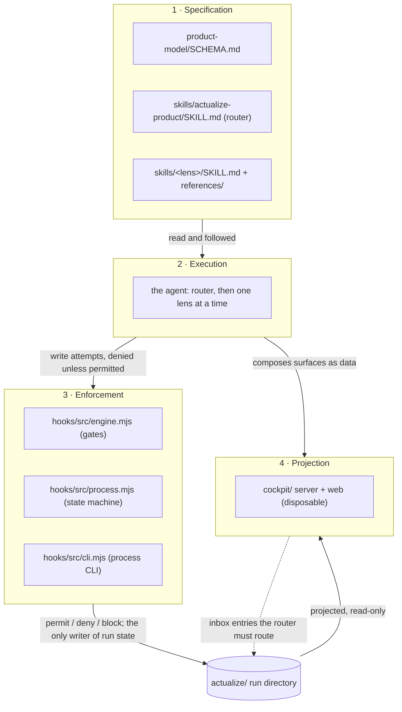

# Architecture

The canonical high-level model of this repository: four layers, four processes, the data stores, and the boundaries
between them. Subsystem detail is not repeated here — [Skills](subsystems/skills.md), [Hooks](subsystems/hooks.md), and
[Cockpit](subsystems/cockpit.md) own how each layer is built; [Concepts](concepts.md) owns the operator's vocabulary;
[Layer 8 reference](reference/cli.md) owns exact tables.

## What kind of thing this is

Not an application. It is two products sharing one repository: a **specification** written in prose
(`product-model/SCHEMA.md` plus `skills/*/SKILL.md` — Markdown, YAML front matter, JSON, `AGENTS.md:4`), and an
**optional runtime** written in code (a dependency-free enforcement engine in `hooks/`, a process CLI, and an optional
cockpit in `cockpit/`, on Bun >= 1.4, `package.json:5-7`).

The head-off for a newcomer: **nothing runs the skills.** No code executes a lens body. `actualize lens start <name>`
returns the body as text and a direct read of it is refused (`engine.mjs:171`; `tests/hooks/replay.test.mjs:37-38`). The
behaviour of this system lives in the prose; the code enforces that prose and projects it. Two checkers, two jobs:
`python3 tests/check.py` validates the *shape* of the specification, `bun test` validates the *behaviour* of the engine
and server (`docs/subsystems/skills.md:44`). Neither substitutes for the other, and neither checks the substance of lens
prose (`docs/subsystems/skills.md:82`).

## Logical architecture

Four layers, and the dependency direction between them is one-way:

1. **Specification.** `product-model/SCHEMA.md` (the model contract, always loaded) and `skills/<lens>/SKILL.md` (the
   judgment, loaded on demand). The normative core: "Everything else in the repo is machinery that serves these Markdown
   files" (`docs/subsystems/skills.md:7`).
2. **Execution.** The agent — any coding agent that can read files (`README.md:6-7`). First the router
   (`skills/actualize-product/SKILL.md`), then one lens at a time. No agent binary lives in this repository.
3. **Enforcement.** `hooks/`: the run state machine (`hooks/src/process.mjs`) and the write gates
   (`hooks/src/engine.mjs`), plus the process CLI the agent invokes (`hooks/src/cli.mjs`).
4. **Projection.** `cockpit/`: the owner's surface. Disposable, never authoritative (`AGENTS.md:13`).



What to notice: the arrows between layers are all one-way. The projection reads the run directory and appends inbox
entries to it, but nothing in layer 4 can reach into layer 1 — no path turns a cockpit gesture into a schema rule, a
lens body, or a grade (`docs/subsystems/cockpit.md:21`, established by hashing every run file before and after tools and
human gestures: only `inbox.jsonl` changes). The projection is also optional: the run and the process work with it
closed (`README.md:120`).

Omitted: the individual lenses and their `needs` edges; the browser and its two tokens; the per-client hook formats;
and the fact that layers 3 and 4 share source files (`hooks/src/lib/{store,md,inbox}.mjs`, `hooks/src/process.mjs`) —
that coupling is at the data layer, not the behavioural one.

## Runtime architecture

Processes that actually exist, over one shared state root. The run directory `actualize/` is the single shared state
(`store.mjs:13,25-40`): found at `ACTUALIZE_DIR`, else the nearest `actualize/` containing `state.json` at or above the
working directory.

- **(a) The agent session.** Any of Claude Code, Codex, Cline, OpenCode, or Pi/Prime (`docs/hooks.md:8-14`). It reaches
  the engine two ways. Subprocess: the client spawns `hooks/bin/actualize` per event, a shell shim that execs
  `bun hooks/src/cli.mjs` (`docs/hooks.md:72`). In-process: `hooks/clients/opencode/actualize.js` and
  `hooks/clients/prime/actualize.ts` import `engine.mjs` directly and skip the process boundary
  (`docs/subsystems/hooks.md:49`). A hook call costs about 10 ms (`docs/hooks.md:72`); in-process hosts pay no spawn. Cline,
  OpenCode, and Pi/Prime have no veto, so there the stop gate reports and relies on the model to continue
  (`docs/subsystems/hooks.md:24`).
- **(b) The process CLI**, invoked by the agent as a subprocess. The only writer of `state.json` and `history/`
  (`engine.mjs:137`; `store.mjs:126`). It dynamically imports the cockpit's own CLI for the `cockpit`, `ui`, and `inbox`
  commands (`cli.mjs:92-97`) — the one place the two halves of the runtime meet.
- **(c) The cockpit daemon**, optional: `bun cockpit/server/serve.ts`, one `Bun.serve` with routes, a WebSocket, and a
  loopback MCP JSON-RPC endpoint at `/mcp` (`serve.ts:45,133-146`). Spawned detached by `actualize cockpit up`.
- **(d) The browser.** Holds a human token in the URL fragment; optionally runs WebMCP in the page (`serve.ts:76`).

Two runtimes, then: the in-process clients and the CLI, both loading the same `engine.mjs`. `bun run build` collapses
(a) through (c) into one compiled executable with `skills/` and `product-model/` beside it (`cockpit/build.ts:14-19`), so
the target needs no Bun. The skills stay real files because agents read them.

## Dependency architecture

Who depends on whom, and why each direction exists.

- **The engine has no dependencies and no client-specific branch** (`engine.mjs:1`); every import is a `node:` module or
  a sibling file. Per-client knowledge lives entirely in `hooks/src/normalize.mjs` and `hooks/adapters/*.mjs`
  (`docs/subsystems/hooks.md:20`), which is what lets one rule set be enforced by five hosts.
- **The engine imports only `node:` modules** because OpenCode and Pi/Prime run it in-process, where a Bun-specific
  import would fail to load (`docs/hooks.md:87`). Bun-specific code is confined to the CLI and the cockpit. That
  constraint comes from the deployment topology, not from taste.
- **`hooks/src/lib/md.mjs` is the single implementation of the SCHEMA checklist**, "standard library only", used by the
  hooks, the CLI, and the tests (`md.mjs:1-3`), so a rule cannot hold in one place and not the other.
  `tests/check.py` is a deliberately independent second implementation, stdlib-only; the reference page names where the
  two differ (`docs/reference/product-model-schema.md:3`).
- **The cockpit depends on the hooks' data layer, not their behaviour.** `cockpit/server/project.ts:5-8` and
  `core.ts:15-16` import `store.mjs`, `md.mjs`, `inbox.mjs`, `process.mjs`. The direction matters: the hooks never call
  the cockpit — they read one line of `.cockpit/context.json` and check its pid (`engine.mjs:60-68`) — so a closed or
  absent cockpit costs the engine nothing.
- **zod is the cockpit's validation boundary** (`package.json:25`): every block a `.strict()` object, every action and op
  a discriminated union, so an unknown property is a `SCHEMA` error with a path, never a silent no-op
  (`docs/subsystems/cockpit.md:48,56`). The skill layer is the opposite shape: Markdown, checked structurally.
- **React, dockview, xyflow, and TanStack are the rendering stack only** (`package.json:19-24`;
  `cockpit/web/Workspace.tsx:3`, `blocks/graph-impl.tsx:2`, `blocks/chart-impl.tsx:3-7`) — which is why the browser is a
  separate trust domain, and why `AGENTS.md:13` forbids the agent any UI code path beyond the typed vocabulary.
- **Bun supplies the server, WebSocket, SQLite (`bun:sqlite`), YAML, bundling, and the test runner** — one runtime for the
  enforcement edge, the server, and the tests, with no Node anywhere (`README.md:7-8`; `AGENTS.md:4`).
- **Nothing under `skills/` depends on the third-party skills it names.** `ffmpeg`, `hallmark`, `playwright-cli` and the
  rest are absent; donor material is restated and no donor is a dependency (`docs/subsystems/skills.md:24`).

## Data architecture

**Origin.** The product's own files — code, schematics, CAD, images, documents, transcripts, media — plus what the owner
says. Router step 1 classifies every input by kind (`SKILL.md:9`). Nothing enters the system any other way.

**Transform.** Recon lenses propose; the router reconciles; the model gains rows; each decision records the `touched`
field keys and the version it created (`SKILL.md:10,12`; `SCHEMA.md:68-70`). A downgrade is applied at once and every
artifact citing that claim goes stale (`SCHEMA.md:52`).

**Persist**, all under `actualize/`: `product-model.md`, `proposals.md`, `artifacts/<lens>/`, `evidence/<lens>/`,
`history/model-v<N>.md`, `inbox.jsonl`, `.log.jsonl`, `state.json`. Ownership per path: `store.mjs:116-131`,
`docs/reference/files-and-layout.md:5-35`. **Project:** the cockpit's SQLite file, regenerated by
`actualize cockpit rebuild` — delete-and-regenerate "proves the DB holds nothing the run directory cannot recreate"
(`sync.ts:120-126`).

```mermaid
flowchart LR
    F["product files + owner statements"] -->|recon lenses propose| P["actualize/proposals.md"]
    P -->|router reconciles: accept, or reject with a reason| M["actualize/product-model.md · authority 1"]
    M -->|model@N, reads, cites| A["actualize/artifacts/&lt;lens&gt;/"]
    L["actualize/evidence/&lt;lens&gt;/"] --> P
    M -->|one snapshot per reconciled version| H["actualize/history/model-vN.md"]
    H -.->|"model restore"| M
    O["owner gesture, in the cockpit or in chat"] --> I["actualize/inbox.jsonl · authority 2, append-only"]
    I -->|router routes it| P
    C["state.json + .log.jsonl"] --> G["gate blockers, next action, rail"]
    M --> G
    A --> G
    G --> X["cockpit SQLite, disposable"]
    G --> Y["status injected into the agent by the hook"]
```

What to notice: there are exactly **two authorities**. `product-model.md` records what the run currently believes, and
`inbox.jsonl` is the ordered, append-only record of what the owner said (`hooks/src/lib/inbox.mjs:1-3`). Everything else is
derived (`state.json`, gate blockers, the rail, SQLite) or reconstructable from those two (`history/`, and `.log.jsonl`,
the engine's own event stream, read back at `sync.ts:47-60`).

Also notice the deliberate asymmetry in the projection: **the cockpit stores references, not artifact bodies.**
`project.ts:48-51` keeps `rel`, `lens`, `built`, `reads`, `cites`, `status`; a body is read on demand through
`safeRunFile`, which accepts only `artifacts/`, `evidence/`, `history/` and re-checks prefix and realpath
(`sources.ts:78-83`) — the same restriction the protocol's `file:` grammar states.

Omitted: the event log the engine appends to on every deny and stop-block (`store.mjs:92-96`), the `.state/` snapshots
taken at `reconcile start`, and `.cockpit/` (agent token, `cockpit.db`, `server.json`, `context.json`), which sits inside
the hooks' protected zone and is denied to the agent (`docs/subsystems/cockpit.md:78`).

## Control flow

- **The router orchestrates the lenses.** Six steps: classify, build, select, reconcile, rebuild stale, verify
  (`SKILL.md:9-14`). It is the only writer of the model and the only one who resolves proposals.
- **The engine orchestrates nothing.** It observes an event plus the files on disk and returns one of
  `{context?, deny?, block?, feedback?, notice?}` (`engine.mjs:2,16-33`). It never advances a wave, picks a lens, or
  edits a field: `computeGate` produces blockers and a next action, and the agent still chooses (`process.mjs:54-107`).
- **The cockpit orchestrates nothing.** It projects, records, and renders. Every owner gesture becomes an inbox entry
  the router must route, and the gate stays blocked while any are unhandled (`process.mjs:77-78`;
  `skills/cockpit/SKILL.md:27`).

The inversion is deliberate. Usually a manager drives the workers; here the agent is the only writer and the tools it
uses are gates, not managers. The engine's vocabulary is permit, deny, and report — the stop gate blocks four times, then
escalates to a notice instead of looping forever (`engine.mjs:249-257`). The cost is that the process cannot be automated
past the agent's judgement, which is the point: the owner wants to know what the agent did, not that a scheduler ran.

## Trust and security boundaries

**Owner and agent.** PRODUCT.md calls these two users "in tension with each other" (`:9`) and states the asymmetry: the
owner "is accountable for the launch bar, and the tool is the thing that tells them honestly whether they have met it"
(`:11`), while the agent "is wrong in a specific way: it will produce something that reads as finished. This product is
built to make that failure hard" (`:13`). Grades, stamps, re-openable sources, a gate that can refuse, and a no-go verdict
that is "a real outcome, not a failure to route around" (`:21`) are the counterweights. Success is "not a green gate the
system produced on its own" (`:25`).

**The grade floor is a trust boundary in content.** Public copy may cite only `OBSERVED` or `VERIFIED`
(`SCHEMA.md:49-52`), and "public-facing" is enumerated: site, store listing, packaging, README intro, captions,
voiceover, alt text, sales scripts. Not a style rule — enforced at write time by `validateArtifact`, which reports
`public artifact cites C7 graded REPORTED` and the engine denies the write (`md.mjs:198`; `engine.mjs:164-166`;
exercised at `tests/hooks/physical.test.mjs:143`). Grades move up only with a new source and down on any contradiction
(`SCHEMA.md:51-52`).

**Cockpit authority, enforced by transport.** Three tiers: system owns the rail, gate state, the model, and grades
(read-only, unaddressable by any action); agent owns surface content, annotations, questions, focus; owner owns layout,
pins, filters and sorts, answers, rulings, confirmations (`docs/subsystems/cockpit.md:80`). The tiers follow from which
token you hold, not from what the UI hides: two random tokens per start, only a human token opens `/ws`, the socket
accepts only `HUMAN_OPS`, and a `human.*` op on the agent path is refused by the reducer with `AUTHORITY_HUMAN`
(`serve.ts:22-33,54-56,97`; `workspace.ts:180`). The honest limit: **this does not sandbox a hostile local shell, which
can read the token like any other file** (`docs/subsystems/cockpit.md:44`). The second layer is the hook denial of
direct writes to `inbox.jsonl` and `.cockpit/` (`store.mjs:126`; `tests/cockpit/hooks-bun.test.ts:100-107`).

**Physical.** `PHYSICAL-PREFLIGHT.md:9-14` defines four action classes. Read-only discovery is never blocked — the router
keeps it separate (`SKILL.md:20`) and the classifier matches only flashing and erasing tools (`engine.mjs:73-93`;
asserted in `tests/hooks/physical.test.mjs:66`). Reversible low-energy needs one action-log line. State-changing needs a
recorded preflight carrying target, expected result, and recovery, inside a running physical lens
(`engine.mjs:98-105`). Irreversible — fuses, secure boot, OTP, locked erase — is denied unconditionally; the only path is
`pause` and the owner runs it (`engine.mjs:96`; `tests/hooks/physical.test.mjs:121`).

**Served content is inert.** A product's files can include HTML. Only six known image types get their own content type;
everything else is `text/plain` with `nosniff` and a `sandbox; default-src 'none'` CSP (`serve.ts:20,72-75`). Every
request needs a loopback `Host` and, when a browser sends one, a loopback `Origin`, so DNS rebinding and another local
page are refused with 403 (`serve.ts:34-41`); bodies over 1 MB are refused. The `file:` grammar rejects `..`, absolute
paths, and anything outside `artifacts/`, `evidence/`, `history/`.

**Other named boundaries.** Product files change only inside a running lens, in strict mode (`engine.mjs:151`). Lens
bodies load only through `lens start` (`engine.mjs:171`). `state.json`, `.state/`, `.log.jsonl`, `inbox.jsonl`, and
`history/` are CLI-managed and denied to the agent (`engine.mjs:137`; `store.mjs:126-127`); an out-of-band model edit is
caught by hash comparison and surfaces as `model-tampered` (`process.mjs:68`). With no run at or above the working
directory, the engine returns `null` for every event and stays silent (`engine.mjs:17-18`).

## Reading paths

| intent | read |
|---|---|
| learn the system | [Getting started](getting-started.md) → [Concepts](concepts.md) → this page |
| understand a decision | [PRODUCT.md](../PRODUCT.md) (why) · [DESIGN.md](../DESIGN.md) (look) · [Why the model is graded](explanation/why-the-model-is-graded.md) |
| run it | [Getting started](getting-started.md) · [Hooks](hooks.md) · [Cockpit](cockpit.md) · [A full run](workflows/a-full-run.md) · [Products with hardware](physical-products.md) |
| change the skills | [Skills subsystem](subsystems/skills.md) · [SCHEMA.md](../product-model/SCHEMA.md) · then `python3 tests/check.py` |
| change the engine | [Hooks subsystem](subsystems/hooks.md) · [Hook enforcement](workflows/hook-enforcement.md) · then `bun test` |
| change the cockpit | [Cockpit subsystem](subsystems/cockpit.md) · [A live cockpit session](workflows/cockpit-session.md) · [Cockpit protocol](reference/cockpit-protocol.md) |
| debug a refusal | [Hooks troubleshooting](hooks.md#troubleshooting) · [A full run, failure branches](workflows/a-full-run.md#failure-branches) (every denial, with its rule) · [gate blocker codes](reference/cli.md#gate-blocker-codes) |
| look something up | [Reference index](reference.md) — [CLI](reference/cli.md) · [Product Model](reference/product-model-schema.md) · [Cockpit protocol](reference/cockpit-protocol.md) · [Files and layout](reference/files-and-layout.md) |
| trace a real run | [Loam](../tests/walkthrough/TRANSCRIPT.md), to a `defer` · [Mote](../tests/walkthrough-mote/TRANSCRIPT.md), to a `no-go` · replayed by `tests/hooks/replay.test.mjs` and `tests/hooks/physical.test.mjs` |

### Source trail

- Framing: `README.md:6-8,20-37,96-113,115-127`; `AGENTS.md:1-14`; `PRODUCT.md:9,11,13,21,25`; `package.json:5-9,18-33`; `justfile:1-30`.
- Layers and non-duplication: `docs/subsystems/skills.md:3,7,22,24,44,82`; `docs/subsystems/hooks.md:3,20-24,44,49,161`; `docs/subsystems/cockpit.md:3,7,20-24,42,44,80,94,104`.
- Runtime: `docs/hooks.md:8-16,45,72,86-87`; `hooks/bin/actualize`; `hooks/clients/opencode/actualize.js:6-39`; `hooks/clients/prime/actualize.ts:8-42`; `hooks/src/cli.mjs:83-97`; `cockpit/server/serve.ts:22-33,45,105-123,133-146`; `cockpit/build.ts:14-19`; `cockpit/server/dev.ts:5-7`.
- Dependencies: `hooks/src/engine.mjs:1-8`; `hooks/src/lib/md.mjs:1-9`; `hooks/src/lib/store.mjs:1-12`; `hooks/src/lib/lenses.mjs:1-6`; `cockpit/server/project.ts:1-8`; `cockpit/server/core.ts:1-16`; `cockpit/web/Workspace.tsx:3-4`; `cockpit/web/blocks/graph-impl.tsx:2`; `cockpit/web/blocks/chart-impl.tsx:3-7`; `cockpit/protocol/actions.ts:32-34,59-63`; `cockpit/protocol/spec.ts:165,168-183`; `docs/hooks.md:87`; `PROVENANCE.md:1-5`.
- Data: `hooks/src/lib/store.mjs:13,25-40,42-57,72-96,116-131`; `hooks/src/lib/inbox.mjs:1-44`; `hooks/src/lib/md.mjs:158-229`; `cockpit/server/project.ts:26-92`; `cockpit/server/sync.ts:1-4,25-42,96-127`; `cockpit/server/sources.ts:78-95`; `docs/reference/files-and-layout.md:5-35`.
- Control: `skills/actualize-product/SKILL.md:9-22`; `hooks/src/engine.mjs:16-33,242-262`; `hooks/src/process.mjs:54-107`; `skills/cockpit/SKILL.md:11,17,24-30`.
- Trust: `PRODUCT.md:9-15,21,25,45,48`; `product-model/SCHEMA.md:35-52,66-75`; `hooks/src/lib/md.mjs:198,206`; `hooks/src/engine.mjs:60-68,73-106,137,151,171`; `product-model/PHYSICAL-PREFLIGHT.md:1-5,9-17,19-33,35-50`; `cockpit/server/serve.ts:17-20,30-41,54-56,70-75,97`; `cockpit/protocol/actions.ts:63,66-70`; `cockpit/server/sources.ts:78-83`; `docs/subsystems/cockpit.md:42,44,78,91-95`.
- Evidence: `tests/hooks/replay.test.mjs:16-21,31-41,191-194,199-211`; `tests/hooks/physical.test.mjs:50-67,104-137,139-147`; `tests/cockpit/authority.test.ts:54-69,116-147,150-199`; `tests/cockpit/hooks-bun.test.ts:100-107`; `docs/workflows/a-full-run.md:1-63,152-174`.
