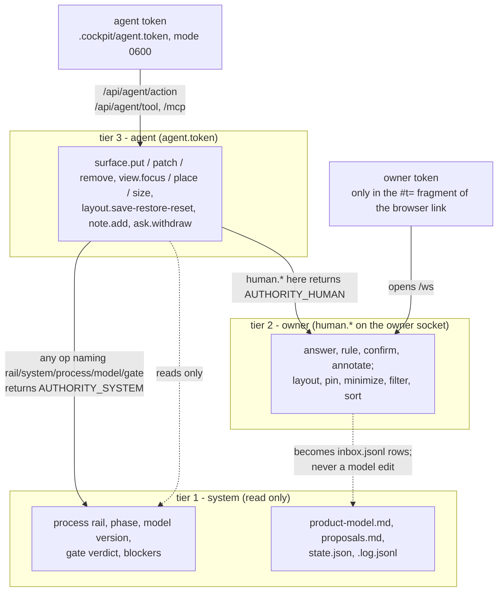

# Why authority is never transferred

Layer 5. It answers two questions the rule `AGENTS.md:13` and `PRODUCT.md:47` state but do not argue for: why
the agent can never simply apply the owner's answer, and why the cockpit can never edit the model. For what the
cockpit *is*, read [`../subsystems/cockpit.md`](../subsystems/cockpit.md); for the run sequence, read
[`why-progressive-disclosure.md`](why-progressive-disclosure.md).

`PRODUCT.md:47` (Design Principle 3): "Authority is visible and never transferable … the cockpit shows, it does not
decide … The interface must never let it look as though something was applied when it was only recorded." The same
principle names both halves of this page. Each claim below is marked **VERIFIED** (a rule in code, a test, or a
stated intent in PRODUCT.md/AGENTS.md) or **INFERRED** (my reading of the consequence, which no document in this
repository argues for).

## The three tiers are enforced twice: by transport, and by the reducer

`cockpit/server/workspace.ts:3-7` states the tiers in the reducer's own header, and `cockpit/server/serve.ts:3-6`
states them again at the transport. That duplication is the design, not redundancy.

**Transport is the role boundary.** Two random 18-byte tokens are minted per start (`serve.ts:15,24`). The human
token appears only in the `#t=` fragment of the link the client prints; the browser lifts it into `sessionStorage`
and strips it from the address bar (`cockpit/web/store.ts:25-29`). The agent token is written to
`.cockpit/agent.token` with mode `0600` (`serve.ts:27-28`). Only a human token may upgrade to `/ws`
(`serve.ts:54-56`), and the socket handler drops anything whose op is not in `HUMAN_OPS` (`serve.ts:97`). Every
request must carry a loopback `Host`, and a browser-supplied `Origin` must be loopback too (`serve.ts:34-41`) —
that is the DNS-rebinding and cross-local-page guard, asserted at `authority.test.ts:111-114,161-164`. VERIFIED.

So the agent cannot *send* an owner gesture. And if it tries anyway over the agent channel, the reducer refuses it
independently of transport: `applyAgent` fails any op that fails the agent schema, and a `human.*` op becomes
`AUTHORITY_HUMAN` — "`human.answer` belongs to the owner; an agent can request an answer with an ask block but
cannot give one" (`workspace.ts:180`). A test drives all four authority ops through the action endpoint, the tool
endpoint, and MCP, and expects a refusal from each (`authority.test.ts:96-107`). VERIFIED.

**The cockpit cannot edit the model because it holds no reference to it.** `applyHuman` reduces the owner's gesture
against the workspace state and emits `Inbound[]`; `Cockpit.human` appends each entry to `inbox.jsonl` and stops
there (`core.ts:134-152`). The strongest evidence is a whole-run-directory hash: the test plays four rulings, an
answer, and an annotation through a real owner socket, then rehashes every file under the run directory except
`.cockpit/`, and asserts that the only file that changed is `inbox.jsonl` — and that `P24` and `P25` are still
`open` (`authority.test.ts:54-69`). The non-responsibility is stated in the subsystem guide: the cockpit does not
edit `product-model.md`, `proposals.md`, `state.json`, or `.log.jsonl`
([`docs/subsystems/cockpit.md:21`](../subsystems/cockpit.md)). VERIFIED.

## The honest limit: this separates UI paths, not the machine

`docs/subsystems/cockpit.md:44` says it in one sentence: "This separates UI paths — a WebMCP caller in the page, a
tool-calling model, injected content — from the owner. It does **not** sandbox a hostile local shell, which can
read the token like any other file." The agent token sits in the run directory; `cat` reads it. Nothing in the
cockpit stops a process that has the owner's filesystem access. VERIFIED.

**The second layer is the hook engine.** The engine refuses a write to the protected zone regardless of who is
making it. `zoneOf` classifies `state.json`, `.state/`, `.cockpit/`, `.log.jsonl`, and `inbox.jsonl` as one zone
(`store.mjs:126`), and `preTool` refuses them with "`…` is managed by the process CLI and cannot be edited
directly" (`engine.mjs:137`). `tests/cockpit/hooks-bun.test.ts:100-107` drives a real Claude Code `PreToolUse`
payload at each of `actualize/inbox.jsonl`, `.cockpit/cockpit.db`, `.cockpit/agent.token`, and
`.cockpit/context.json` and requires `permissionDecision: "deny"`. VERIFIED.

So the ordering is: transport keeps UI callers apart, and the engine keeps *the agent* apart from the channel
whatever transport it uses. Neither is a sandbox; together they mean a mistaken gesture cannot be expressed, and a
deliberate file write is denied. INFERRED that this pair is the intended reading of Design Principle 3 applied to
the inbox — PRODUCT.md states the principle; it does not name these two mechanisms.

### Source trail

- `PRODUCT.md` — Design Principles §3 "Authority is visible and never transferable"; `## Users`; `## Anti-references`
- `AGENTS.md:13` — the cockpit "never owns state"; the owner gesture is an inbox entry the router handles
- `cockpit/protocol/actions.ts` — `AUTHORITY_OPS`, the agent-op and human-op lists, the `AUTHORITY_*` codes
- `cockpit/server/workspace.ts` — `applyAgent`, `applyHuman`, `AUTHORITY_SYSTEM`, `AUTHORITY_LAYOUT`,
  `AUTHORITY_PINNED`
- `cockpit/server/serve.ts` — `roleOf`, the loopback and `Origin` guard, the human/agent token split
- `cockpit/server/core.ts` — `human` handler appending to the inbox, `writeContext`
- `cockpit/web/store.ts` — the browser holding the owner token from the link
- `cockpit/web/App.tsx` — `RailView`, rendered as a fixed `<header className="rail">` outside the Dockview workspace,
  so no surface can cover it
- `cockpit/web/Workspace.tsx` — the Dockview layout, the only thing a surface can occupy
- `hooks/src/lib/inbox.mjs` — `readInbox`, `ackInbox`, `unhandled`
- `hooks/src/engine.mjs` — the CLI-managed write zones that deny the agent `inbox.jsonl` and `.cockpit/`
- `tests/cockpit/authority.test.ts` — the transport, role, and malformed-input contracts
- `docs/subsystems/cockpit.md`, `docs/workflows/cockpit-session.md`
