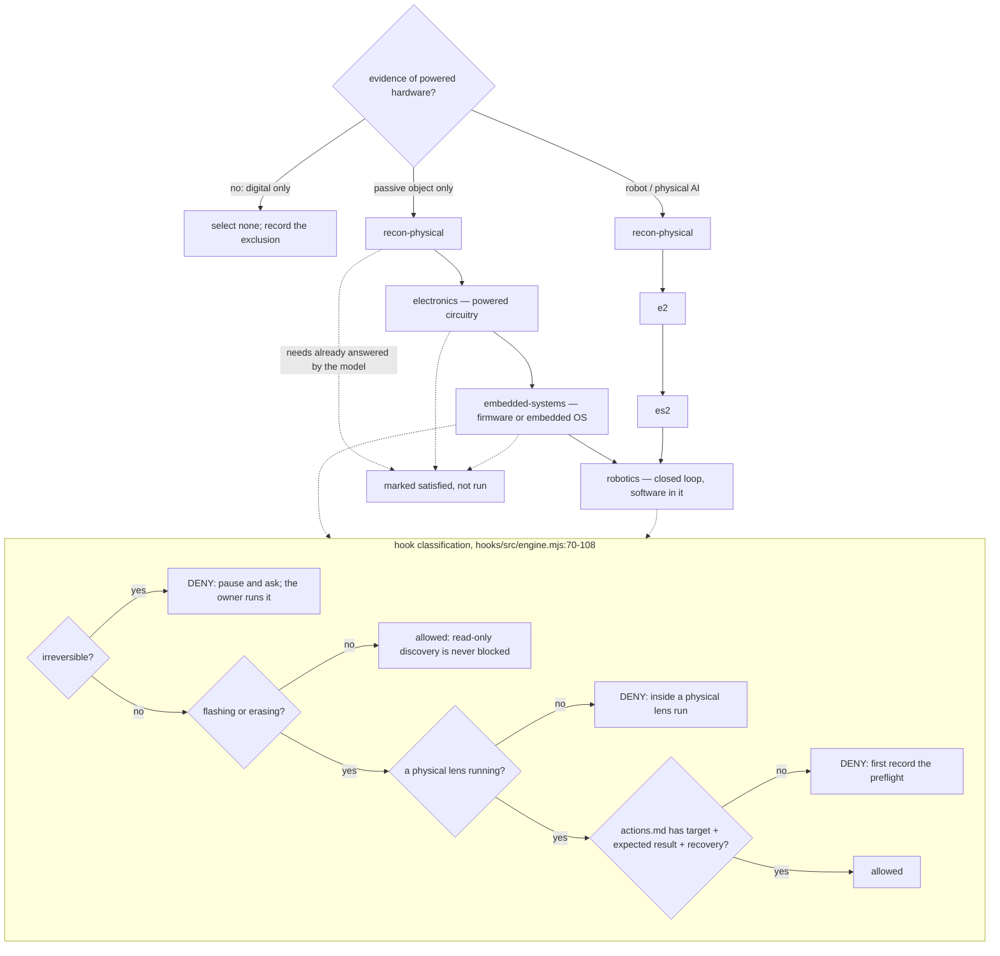

# Why the physical lenses load only on evidence

An explanation page. It answers *why* the physical lens chain is a strictly linear, evidence-gated sequence
rather than a set of always-available capabilities, and why a preflight record is required before any
state-changing command reaches a unit. For the rules read
[`../physical-products.md`](../physical-products.md) and
[`../../product-model/PHYSICAL-PREFLIGHT.md`](../../product-model/PHYSICAL-PREFLIGHT.md); for the commands read
[`../reference/cli.md`](../reference/cli.md).

Marked **VERIFIED** (written in this repository) or **INFERRED** (my reading of a consequence nobody stated).

## The chain is linear and enforced as such

`needs` in the four physical lens frontmatters is a straight line, not a graph:

| lens | `needs` | use condition from its `description` |
|---|---|---|
| `recon-physical` | `[]` | "when any evidence is a non-code artifact or the product contains hardware" |
| `electronics` | `[recon-physical]` | "contains powered circuitry … not for passive objects or software-only products" |
| `embedded-systems` | `[electronics]` | "has a microcontroller or SBC" |
| `robotics` | `[embedded-systems]` | "senses and acts on the physical world with software in the loop" |

`check_physical_chain` asserts all three edges without exception, requires every one of the four bodies to name
`product-model/PHYSICAL-PREFLIGHT.md`, requires the router to enforce it, and requires `robotics` to mark ROS as
loaded only when ROS is present (`tests/check.py:218-236`). Six routing scenarios must close under `needs`: a
digital-only product and a passive physical product select none of `electronics`/`embedded-systems`/`robotics`
(`tests/check.py:190-197`). VERIFIED.

## Why hardware identity has to come first

Every later physical lens judges against an exact revision, and none of them re-derives identity:

- `electronics`: "Component identity, revisions, and documented values come from
  `evidence/recon-physical/hardware/`; this lens never re-derives them, and sends a doubtful identity back as an
  unknown."
- `embedded-systems`: "Target identity, pin maps of record, and documented limits come from
  `evidence/recon-physical/hardware/`."
- `robotics`: "Hardware facts come from `evidence/recon-physical/hardware/`, electrical limits from
  `electronics`, firmware and boot facts from `embedded-systems`."

VERIFIED, all three from the lens bodies. A physical lens without recon upstream would be judging an electrical
implementation, a pin map, or a motion envelope against an unestablished revision — it has no way to say what
the unit even is. INFERRED: this is why the edges are mandatory rather than advisory.

The Mote walkthrough shows the cost. `recon-physical` found the assembly guide and BOM at rev B while the
schematic, CAD, and hardware guide are REV C, the firmware pin map labelled REV B, one console log from a
REV B board, and the unit's silkscreen revision letter hidden under a bracket
(`tests/walkthrough-mote/TRANSCRIPT.md:36-38`). Four of the walkthrough's 15 contradictions are revision
mismatches, recorded as contradictions "not averaged" (`:38`); the hidden letter had to be answered by the owner
before the claim could close (`:130`). No downstream lens could have produced that contradiction, because none
was in a position to say which revision it was describing.

## Why a satisfied `needs` is a skip, not a run

The router: "a lens whose `needs` the model already answers is marked satisfied, not run"
(`skills/actualize-product/SKILL.md:11`). `select --satisfied` records that, and a declared satisfied lens
closes the edge without being run — the Raspberry Pi voice device scenario selects `recon-physical,
embedded-systems, release-readiness` with `electronics` satisfied; the ROS 2 robot selects `robotics` with both
`electronics` and `embedded-systems` satisfied (`tests/check.py:194,196`). VERIFIED.

The gate behind it is mechanical: `waves()` places a lens only after every `needs` is `done` or not selected
(`hooks/src/lib/lenses.mjs:35-47`), and `select` fails if a `needs` is neither selected nor declared satisfied.
The test asserts the live behaviour: a digital-only goal produces waves containing none of the three physical
lenses, `lensStart("electronics")` throws `/not in the selection/`, and `robotics.needs` is still exactly
`["embedded-systems"]` (`tests/hooks/physical.test.mjs:200-209`). VERIFIED.

## Why a preflight record exists at all

`PHYSICAL-PREFLIGHT.md:1-5` states the purpose: the discipline "exists so that a state change on real hardware
is intended, bounded, observed, and recoverable, not to slow down looking." It defines four action classes —
read-only discovery (no requirement), reversible low energy (one action-log line), state-changing (full
preflight), irreversible (full preflight plus explicit per-action confirmation) (`:9-14`).

The rule that makes it a *physical* document rather than a paperwork document:

> **Discovery that mutates is an action.** A bus scan can write, opening a serial port can toggle DTR/RTS and
> reset the target, probing can brown a rail, listing an audio device can wake an amplifier, and cleanup commands
> can kill the wrong process. Classify by effect, not by verb.

(`PHYSICAL-PREFLIGHT.md:16-17`). The command's verb is the cheapest thing to pattern-match and the least
reliable description of what it does to a device. INFERRED: the four classes exist because effect is the only
thing the operator can actually control.

## Why bounded completion is enforced on the device

> **Bound the action locally.** Never rely on the agent, the network, or the session staying alive to send a
> later stop. The duration, step limit, or current limit travels with the command and is enforced on the device
> or in the same process that actuates. Signals do not run cleanup (a terminated process skips its `finally`),
> so a safe end state is a property of the device, not of a handler.

(`PHYSICAL-PREFLIGHT.md:37-39`). The second sentence is the reason: a `finally` is a property of a process
lifetime, and a process that was killed does not have one. A servo's travel limit has to be set on the servo.

## Why read-only is never blocked, and why irreversible is always denied

The hook classifies by effect against two regexes (`hooks/src/engine.mjs:70-93`), and the order matters:
`IRREVERSIBLE` is tested first and returns its own message before `FLASH` is considered (`:95-96`). The
irreversible message ends "Record the preflight, then `actualize pause --reason "<the confirmation needed>"` and
ask; the owner runs it" — the agent is routed to stop, not to proceed. VERIFIED.

The test walks all of it in one sequence (`tests/hooks/physical.test.mjs:114-122`): `esptool.py … chip_id` is
allowed (read-only enumeration is never gated); `esptool.py … write_flash 0x0 fw.bin` is denied
`/first record the preflight/` even though a physical lens is running, so the failure is the missing record and
not the missing lens; and earlier in the same file `picotool info -a` is allowed with the assertion message
"read-only discovery is never blocked" (`:66`) while `picotool load fw.uf2 -f` is denied `/inside a physical
lens run/` (`:65`).

Two details of the check matter. With `actions.md` containing only "No state-changing action was taken.",
`west flash` is still denied — the check is for the three field headings `target`, `expected result`, and
`recovery` (`hooks/src/engine.mjs:99-103`), not for the word "flash" and not for a prose refusal. Once those
three headings are written, `west flash` is allowed. And then `espefuse.py … burn_efuse FLASH_CRYPT_CNT` is
denied `/irreversible/` — with a valid preflight present, inside a running lens.

That last line is the one that matters: a recorded preflight is necessary and not sufficient. An eFuse burn is
denied even in a running physical lens with a complete preflight, because the class requires "explicit
per-action confirmation, even in an authorized run" (`PHYSICAL-PREFLIGHT.md:14`) and the confirmation is the
owner's, executed by the owner. VERIFIED.

## The trade-off

The gate buys one property: no irreversible change to real hardware happens on the agent's authority alone, and
no state-changing change happens without a written record naming target, expectation, and recovery before it is
attempted. It costs:

1. **Throughput, and honest non-coverage.** Every flashing step costs a preflight block. The Mote walkthrough
   exercises these rules against the hook rather than against hardware; its recorded state is "flashing was
   exercised against the hook only" (`tests/hooks/physical.test.mjs:122`). The guard is proven; the action is
   not.
2. **Engine coverage is a regex list.** `FLASH` names thirteen tool invocations and the header comment says so:
   "Deliberately conservative: flashing and erasing tools only" (`hooks/src/engine.mjs:71`). A power cycle, a
   rewiring, or a motor command is not in the regex; those are governed by the preflight document and the owner's
   judgement. INFERRED: the engine is a backstop for the most destructive common class, not the discipline.
3. **The chain is rigid where reality is not.** `--satisfied` is the escape hatch for a product whose control
   logic lives off-board, but `check_physical_chain` will not let any product run `robotics` without
   `embedded-systems` selected or satisfied (`tests/check.py:218-224`). The product must declare the
   satisfaction rather than run the lens.

### Source trail

- Chain edges: `skills/{recon-physical,electronics,embedded-systems,robotics}/SKILL.md` frontmatter; asserted `tests/check.py:218-236`.
- Identity is not re-derived: `skills/electronics/SKILL.md:9-11`; `skills/embedded-systems/SKILL.md:9-11`; `skills/robotics/SKILL.md:9-11`.
- Router rules: `skills/actualize-product/SKILL.md:11,20`; `docs/physical-products.md:3-4,16-17,63-67`.
- `needs` enforcement: `hooks/src/lib/lenses.mjs:35-47`; `tests/hooks/physical.test.mjs:200-209`; `tests/check.py:190-197,237-244`.
- Preflight document: `product-model/PHYSICAL-PREFLIGHT.md:1-5,9-17,21-33,37-39`.
- Hook classification and messages: `hooks/src/engine.mjs:70-108`.
- Denials and allows in sequence: `tests/hooks/physical.test.mjs:65-66,114-122`.
- Revision contradictions and the owner answer: `tests/walkthrough-mote/TRANSCRIPT.md:36-38,130`.
