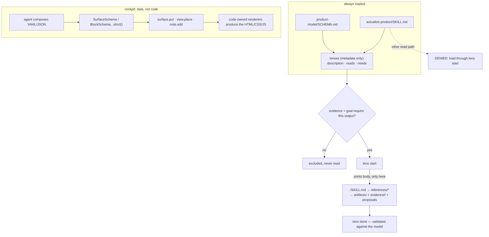

# Why disclosure is progressive, and the cockpit is a vocabulary

An explanation page. It answers two *why* questions — why the router and the schema are the only always-loaded
text, and why the cockpit accepts data against a closed vocabulary instead of agent-authored UI code. For the
mechanics read [`../reference/cli.md`](../reference/cli.md),
[`../reference/cockpit-protocol.md`](../reference/cockpit-protocol.md), and [`../architecture.md`](../architecture.md).

Marked **VERIFIED** (a statement written in this repository) or **INFERRED** (my reading of a consequence
nobody stated).

## Why only the router and the schema

Seventeen lenses live under `skills/` (`audio-sound`, `brand`, `direction`, `electronics`,
`embedded-systems`, `experience`, `fidelity-qa`, `illustration`, `legacy-modernization`, `marketing`,
`motion-editorial`, `product-visualization`, `provenance-licensing`, `recon-physical`, `recon-software`,
`release-readiness`, `robotics`) at 60–100 lines each (`AGENTS.md:7`). Together that is far more context than
any single run needs — a run typically selects three to six. Loading all of it would keep unused professional
vocabularies in front of the agent for the whole session, which is the pressure that makes a model "produce
something that reads as finished" (PRODUCT.md:13). That the cost is worth paying is INFERRED; no document
argues for it.

The router is 22 lines and states the whole process in six steps; the schema is 88 lines and is the only contract
every artifact is validated against. INFERRED: this pair is chosen because it is the intersection of what the
lenses need, not the union — everything else is optional and situational.

The code makes the split mechanical rather than advisory:

- `loadLenses` reads each `SKILL.md`, keeps only `description`, `reads`, `needs`, `executes_with` from the
  frontmatter, and discards the text (`hooks/src/lib/lenses.mjs:9-28`). It returns metadata, not content.
- `actualize lenses` prints that metadata and nothing else — "No bodies loaded"
  (`docs/reference/product-model-schema.md:33`), implemented at `hooks/src/cli.mjs:116`.
- `lensBody` is the only reader of the body text (`hooks/src/lib/lenses.mjs:30-32`), and its only caller is
  `lensStart`, which returns `{ body, reads }` (`hooks/src/process.mjs:203`). `lens start` prints it between
  `----- <name>/SKILL.md -----` markers (`hooks/src/cli.mjs:136`).

Disclosure is therefore one command, and it is the same command that opens the write scope: loading a body and
starting the lens are the same act, so a body is never disclosed speculatively. VERIFIED.

The router says the same in prose: "Read only the frontmatter (`description`, `reads`, `needs`) … Load a lens
body only when you run it" (`SKILL.md:11`). `references/` extends the rule one level down (`AGENTS.md:8`), and
`lensOfPath` treats `references` as a disclosure target under the same gate as `SKILL.md`
(`hooks/src/lib/lenses.mjs:56`).

## Why reading a body is denied outside `lens start`

The enforcement is one denial in the engine: for any read target inside the skills directory that is a lens
body or a reference, if that lens is not active, the read is blocked with

> lens bodies load only through `<cli> lens start <lens>` (progressive disclosure). `<cli> lenses` lists every
> lens's description, reads, and needs.

(`hooks/src/engine.mjs:168-172`). The message names the command that would work, so a refusal is a routing
instruction rather than a wall. Both the read tool and the `cat` path are tested
(`tests/hooks/replay.test.mjs:37-38`); the `cat` case is caught by tokenising the command
(`hooks/src/engine.mjs:184-203`), so the rule is not bypassable by shelling out. The block runs in strict
mode only, which is the default (`hooks/src/cli.mjs:100`). VERIFIED.

## Why the cockpit is a vocabulary, not a code path

The cockpit gets the same treatment for the same reason: the agent is a plausible-sounding author, not a
trusted designer. The mitigation is structural rather than advisory.

- `cockpit/protocol/spec.ts:1-3` states the contract in one line: "Code owns this file; the agent composes it
  as data and never writes UI code. 15 blocks, each with a distinct interaction or distinction a human relies
  on. `.strict()` everywhere: an unknown property is an error, not a silent no-op, so the agent gets
  machine-readable feedback instead of a broken view."
- Everything is `.strict()`: `SurfaceSchema` (`spec.ts:168-183`), each block schema, `PlacementSchema`
  (`spec.ts:189-194`). An unrecognised key fails validation rather than being dropped.
- Sources are a closed grammar: `pa:` over thirteen named projections, `graph:` over four, and `file:`
  restricted to `artifacts|evidence|history` with no `..` (`spec.ts:16-22`). A surface cannot be pointed at an
  arbitrary path.
- `refs` are a closed set of prefixes — `claim:`, `unknown:`, `proposal:`, `decision:`, `artifact:`,
  `evidence:`, `lens:`, `field:`, `version:`, `gate` (`cockpit/protocol/catalog.ts:48`).
- Ops are a closed list: `surface.put`, `surface.patch`, `surface.remove`, `view.focus`, `view.place`,
  `view.size`, `layout.save`, `layout.restore`, `layout.reset`, `note.add`, `ask.withdraw`
  (`catalog.ts:50`), each with a rule attached (`catalog.ts:51`).
- `catalog.ts` gives each block a `use`, an `avoid`, what the human can do with it, and a minimal example that
  is parsed against the schema in tests, "so this file cannot drift from the code that renders"
  (`catalog.ts:2`).
- `AGENTS.md:13` closes the escape hatch with a prohibition: "Do not add UI code paths the agent could reach
  other than the typed vocabulary."
- Agent-supplied inline data is always rendered with an "agent-supplied" mark, "so a surface cannot pass its
  own numbers off as process state" (`spec.ts:15`; the tag is rendered at `cockpit/web/Surface.tsx:30`).

INFERRED: the rejected alternative here is an agent-authored HTML/JS panel. It is not recorded as having been
built; the shape of the prohibition implies it. What is VERIFIED is the mechanism and the stated reason for it.

## The trade-off

A closed vocabulary buys enforcement and costs expressiveness. Three costs, all visible in the code:

1. **New visual needs require a protocol change.** A surface is `layout: stack | columns` and 1–12 blocks of
   fifteen types (`spec.ts:165,168-173`). Anything a new need wants beyond that set is a schema edit, a
   `REGISTRY` entry, a new `.tsx` renderer, and a catalog entry — not an agent decision.
2. **`layout: "columns"` already promises more than it implements.** The schema comment says "columns: two
   equal columns, blocks alternate" (`spec.ts:172`) and the catalog advertises `layout: stack|columns` to the
   agent (`catalog.ts:46`). The renderer maps `columns` to a CSS class (`cockpit/web/Surface.tsx:31`) and that
   class is `grid-template-columns: repeat(auto-fit, minmax(300px, 1fr))` (`cockpit/web/styles.css:74`) — a
   fluid auto-fit grid, not two alternating columns. Document and implementation disagree today. This is the
   clearest live instance of the cost: a closed vocabulary is a promise, and the promise is maintained by hand.
3. **The vocabulary caps judgement, not just layout.** The owner-facing blocks are `ask` and `form`, limited to
   the inputs listed at `catalog.ts:34-37`. A judgement only the owner can make must fit one of those shapes,
   or the protocol has to grow.

What it buys: the agent cannot invent a panel, cannot pass a number off as process state, cannot redirect a
source to a path the grammar rejects, and cannot reach a renderer that a human did not write. The owner's side
stays legible and hard to route around, which is the stated intent: "Authority is visible and never
transferable" (PRODUCT.md:47), "the cockpit shows, it does not decide" (PRODUCT.md:23).

### Source trail

- Always-loaded pair: `skills/actualize-product/SKILL.md:1-22`; `product-model/SCHEMA.md:1-88`; `AGENTS.md:6-9`.
- Lens list and structure: `skills/` listing (19 entries; router and `kind: tool` skill excluded); `AGENTS.md:7-9`.
- Metadata-only loading: `hooks/src/lib/lenses.mjs:9-28,30-32,49-58`; `hooks/src/cli.mjs:115-118`; `docs/reference/product-model-schema.md:33`.
- Body disclosure: `hooks/src/process.mjs:199-203`; `hooks/src/cli.mjs:134-137`.
- Read denial: `hooks/src/engine.mjs:168-172`; tokenisation `hooks/src/engine.mjs:184-203`; strict default `hooks/src/cli.mjs:100`; tests `tests/hooks/replay.test.mjs:37-38`.
- Cockpit vocabulary: `cockpit/protocol/spec.ts:1-3,15-22,165,168-183,189-194`; `cockpit/protocol/catalog.ts:1-2,34-37,46-51`; `AGENTS.md:13`.
- `layout: "columns"` divergence: `cockpit/protocol/spec.ts:172`; `cockpit/protocol/catalog.ts:46`; `cockpit/web/Surface.tsx:31`; `cockpit/web/styles.css:74`.
- Agent-supplied mark: `cockpit/protocol/spec.ts:15`; `cockpit/web/Surface.tsx:30`. Product constraints: `PRODUCT.md:13,23,47`.

INFERRED: the rejected alternative here is an agent-authored HTML/JS panel. It is not recorded as having been
built; the shape of the prohibition implies it. What is VERIFIED is the mechanism and the stated reason for it.
