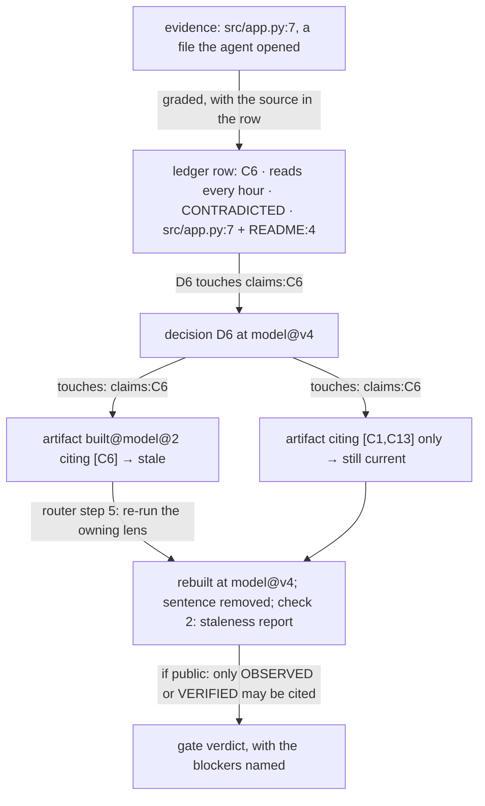

# Why the model is graded

An explanation page: it answers *why* the Product Model carries evidence grades, claim-level staleness, and a
public-citation floor — not what the rules are. For the rules read
[`../reference/product-model-schema.md`](../reference/product-model-schema.md) and [`../concepts.md`](../concepts.md);
for the structure read [`../architecture.md`](../architecture.md).

Each claim below is marked **VERIFIED** (a written statement of intent in PRODUCT.md or SCHEMA.md, or a walkthrough
transcript documenting a design change and the failure that caused it) or **INFERRED** (my reading of the consequence,
not a statement anyone made in this repository).

## Why a claims ledger rather than a feature list

The stated success condition is not a working product; it is an owner who can "state what is true about their product,
cite where each statement came from, and stop at a verdict they believe, with the blockers named" (PRODUCT.md:25) —
explicitly "not a green gate the system produced on its own" (`:25`). The owner is "trying to decide what is actually
true about their product, and they do not fully trust any answer that has not been checked" (`:11`). A feature list
supports neither half: it records what the product does, not how well each statement is known, and it gives the owner
nothing to re-open.

The other user in the system fails in a nameable way: the agent "will produce something that reads as finished"
(PRODUCT.md:13). That failure is stated in PRODUCT.md; that a per-row grade and re-openable source is the *specific*
counterweight is INFERRED — PRODUCT.md records the mechanism (`:13`) without arguing for it.

Rule 4 of the schema is the same move against a different failure: "Nothing is filled by guessing. A gap is an
`unknowns` row, not a plausible sentence" (SCHEMA.md:14). An unknown is a first-class row carrying what it blocks and
who can answer, so a gap is visible rather than smoothed over.

## Why seven grades rather than a binary

A binary (true / not true) collapses the distinction the owner needs: whether you could have *caught this being wrong*.
Each grade answers a different question about that. Definitions are from SCHEMA.md:39-45; the reading of them is
INFERRED:

- `OBSERVED` — the agent looked. "A description of the thing is not the thing." Strong against paraphrase, blind to
  anything not looked at.
- `VERIFIED` — a check that *could have failed* was run, and the source says who and when. The only grade carrying
  information about a failure that did not occur.
- `REPORTED` — a source says so, nobody checked. Where READMEs, transcripts, and spec sheets live.
- `INFERRED` — concluded from other claims, no higher than the weakest parent. Propagates weakness instead of
  laundering it into confidence.
- `PROPOSED` — a decision or aspiration, not yet true. Present so intent has somewhere to go that is not a claim.
- `UNKNOWN` — no evidence; in the ledger only to record that someone wants to claim it.
- `CONTRADICTED` — two sources disagree, the source column names both, "Resolved only by new evidence".

Loam shows these doing work on one product: the README's "SMS alerts" claim meets `NotImplementedError` in
`alerts.py`, producing a `CONTRADICTED` row, and the marketing page then omits SMS entirely
(tests/walkthrough/TRANSCRIPT.md:24-26,59-60). VERIFIED behaviour.

Mote corrected the hardware half of the scheme: a first draft graded every hardware document `REPORTED`, "which erased
the difference between a datasheet (prose about a part) and a schematic or CAD file (the design itself, read directly)".
The fix grades by the claim's subject — design files are `OBSERVED` as that file at its revision, behaviour of the unit
built from them is `INFERRED` and cites the revision claim (tests/walkthrough-mote/TRANSCRIPT.md:176-177; SCHEMA.md:47).
VERIFIED, and a warning against reading grade as a ranking: the seven values are not ordered by reliability across
subjects.

## Why grades move down automatically

"A downgrade makes every artifact citing the claim stale" (SCHEMA.md:52). A downgrade is not a judgement the router is
asked to make; it is a consequence of a decision row that touches claims, applied at reconciliation and at once
(SKILL.md:12). So the design is **stale by construction**: a claim cannot lose evidence and leave confident copy
standing. Loam shows the chain — a `CONTRADICTED` finding on the email-alert sentence, marketing re-running, the
sentence removed, a `VERIFIED` claim cited in its place, the artifact re-stamped at `model@4`
(tests/walkthrough/TRANSCRIPT.md:96-97). That grades move *up* only with a new source is stated at SCHEMA.md:51-52.

## Why staleness is per-field and per-claim

This is the one place where the design carries a documented failure. tests/walkthrough/TRANSCRIPT.md:110-111, verbatim:

> "Field-level staleness alone staled every artifact on any claim change. Fix: artifacts record `cites:`, decisions name
> claim ids (`claims:C4`), and only artifacts citing them go stale (SCHEMA 'Versions and staleness')."

The mechanism that replaced it: each decision row records `touched` field keys, and when it touches claims it names the
ids (`claims:C4` or `claims:C4+C14`; a bare `claims` means all) (SCHEMA.md:69-70). An artifact is stale only if a
decision newer than its `built_from` touched a key in its `reads`, and for claims only the ids in its `cites`
(SCHEMA.md:71-74). The implementation is `touches(touched, reads, cites)` in hooks/src/lib/md.mjs:213-224, called from
`staleReasons` at `:226-229`.

The second forced change is about ordering, same transcript, `:108-109`: "Artifacts built in the same wave as their own
proposals recorded the pre-acceptance version and would have been stale on arrival. Fix: a lens that defines model fields
builds its artifact after reconciliation (router step 4)." Router step 4 says so: "A lens whose artifact cites what it
proposed (brand, direction, the physical lenses) builds that artifact after its proposals are reconciled" (SKILL.md:12).
Mote recorded the same lesson independently for the physical lenses (tests/walkthrough-mote/TRANSCRIPT.md:178). Both
VERIFIED. The effect: field-defining lenses cannot parallelise. In Loam, wave 2 (brand, provenance-licensing) proposes,
reconciles to v2, and *then* builds, so both artifacts record `model@2` (tests/walkthrough/TRANSCRIPT.md:53-55;
`replay.test.mjs:128-141`).

## Why the artifact records `built_from` at all

The stamp answers one question: **was this built from the beliefs the run currently holds?** `built_from: model@N`,
`reads:`, `cites:` in the artifact's first lines (SCHEMA.md:11-13; parsed by `parseStamp`, md.mjs:158-176). It makes the
comparison above mechanical rather than a judgement call, and an unstamped artifact counts as stale (SCHEMA.md:75) — the
default is distrust. `validateArtifact` additionally refuses an artifact whose `built_from` differs from the current
version at write time (md.mjs:193), so stamp drift is caught when written, not at the gate. That the stamp exists to
answer that question rather than to version artifacts is INFERRED.

## The propagation of a single claim

Values from tests/walkthrough/TRANSCRIPT.md:24-26 (C6 contradicted), `:96-97` (marketing re-ran, the sentence was
removed), and docs/workflows/a-full-run.md:146-150 (`beta-page.md` goes model@2 stale to model@4 while `identity.md`
and `ledger.md` stay current; `replay.test.mjs:128-141` is the test that asserts the build-after-reconcile ordering).
The decision id and version numbers in the diagram are illustrative — the transcript's ids differ per run.

## What the public-citation floor costs

`OBSERVED`/`VERIFIED` only, and "public-facing" is drawn widely: site, store listing, packaging, README intro, captions,
voiceover, alt text, sales conversation scripts (SCHEMA.md:49-51). Enforced at write time: a public artifact citing a
`REPORTED` claim is denied (`md.mjs:198`; `tests/hooks/physical.test.mjs:143` denies exactly that edit).

The cost, stated plainly: **brand and marketing can no longer describe anything merely believed.** The Mote run shows
the pressure. A rejected proposal, P21, promised positioning on the model "follows you around the room" — refused because
it rested on a `CONTRADICTED` claim and the loop does not exist (tests/walkthrough-mote/TRANSCRIPT.md:128). And a spec
sheet sentence claiming the head "pans +/-70 degrees" had to be reworded: the CAD claim behind it is `OBSERVED` and
therefore allowed by the grade rule, but a servo range is a physical claim needing command plus observation, so the
sentence became "designed to pan … against bracket stops; travel has not yet been measured on a built unit"
(`:163-164`). That the floor costs marketing language is INFERRED from these two cases; that the design accepts that
cost is stated as intent: "Grades move up only with a new source and down on any contradiction" (SCHEMA.md:51-52) and,
in PRODUCT.md, that confidence is not to be hidden "behind confidence smoothing" (`:39`).

## The trade-off

This is expensive, deliberately. **Reconciliation after every wave** is mandatory and a wave's output is not in the
model until then (SKILL.md:12; the gate blocks on `unreconciled`, process.mjs:61). **Parallel artifact production is
blocked for field-defining lenses** — wave structure that would otherwise be free must be sequenced propose →
reconcile → build (VERIFIED from router step 4 and both transcripts). **A no-go verdict is a normal outcome**:
"A no-go verdict is a real outcome, not a failure to route around" (PRODUCT.md:21); Mote ends at `no-go` with no waivers
(tests/walkthrough-mote/TRANSCRIPT.md:166-169) and Loam at `defer` (tests/walkthrough/TRANSCRIPT.md:99-104). A system
built to make the gate refuse cannot also be a system that always reaches a launch. That this cost is *accepted* rather
than merely incurred is INFERRED; no document in the repository says so.

## The rejected alternative: a spec with a checklist

A PRD records what *should* be true, and cannot distinguish a claim that failed when run from one that was never tried —
the distinction the ledger is built on. Two places show what is lost:

- Loam's C5 and C6 are `CONTRADICTED` only because someone read `alerts.py` and `main.py` and compared them with the
  README (tests/walkthrough/TRANSCRIPT.md:24-26). A checklist has a box for "SMS alerts", and the box gets ticked.
- The Mote gate refuses to pass hardware claims never exercised on the unit. The `PHY` rows carry evidence kind,
  exercised-on-the-unit, and result; `tests/check.py` fails a `go` verdict on any row not `yes`/`pass`, and mutates the
  gate to `verdict: go` to prove the checker can fail (tests/check.py:446-470; and the negative controls at `:480-486`).
  The verdict was `no-go`, blocked on "no physical claim exercised on a REV C unit" among other named blockers
  (tests/walkthrough-mote/TRANSCRIPT.md:166-169,182).

So the walkthroughs are themselves the argument: the statements a PRD would list as features are the ones the gate has
to block. VERIFIED. That no PRD was ever written here is INFERRED — the repository documents the design and its
walkthroughs, not a rejected alternative; the checklist comparison is my reconstruction from what the graded model
catches that the fixture's own README and brief assert without evidence.

### Source trail

- Purpose and users: `PRODUCT.md:11,13,15,21,25,39,45`; `DESIGN.md:96-101`.
- Grades, rules, versions, staleness: `product-model/SCHEMA.md:1-14,35-52,66-75,77-88`.
- Mechanism in code: `hooks/src/lib/md.mjs:8-10,158-176,184-210,213-229`; `hooks/src/engine.mjs:157-167`; `hooks/src/process.mjs:61,82,87`.
- Router ordering rules: `skills/actualize-product/SKILL.md:12-14,17`.
- Loam: `tests/walkthrough/TRANSCRIPT.md:24-26,53-55,59-60,96-97,99-104,106-111`; `tests/hooks/replay.test.mjs:128-141,143-162`.
- Mote: `tests/walkthrough-mote/TRANSCRIPT.md:35-49,128,139-147,160-164,166-169,174-183`; `tests/hooks/physical.test.mjs:114-121,139-147,149-164`.
- Gate rule for hardware claims: `tests/check.py:432-470,473-486`; `skills/release-readiness/SKILL.md:15-25,37-49,52-59`.
- Staleness in a live run: `docs/workflows/a-full-run.md:100-104,146-150`; `docs/reference/product-model-schema.md:142-201`.
