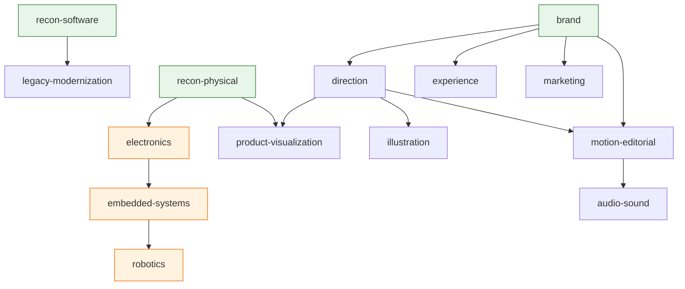

# Reference: lenses

The 17 lenses plus two non-lens skills. `actualize lenses` prints the same `name`, `description`, `reads`, `needs`,
and `executes_with` values from the front matter **without loading any lens body** — that separation is the
progressive-disclosure mechanism, explained in
[why progressive disclosure](../explanation/why-progressive-disclosure.md).

For how a lens is selected, ordered, and run, see [the skills subsystem guide](../subsystems/skills.md).

## File contract

Every lens is `skills/<name>/SKILL.md`, 60-100 lines, with YAML front matter and exactly five sections:

| section | what it holds |
|---|---|
| `## Reads from the model` | the model fields the lens may use; the ceiling for an artifact's `reads:` header |
| `## Distinctions` | how a professional in this field represents the problem — the things they distinguish |
| `## Failure modes` | what goes wrong in this discipline, and the symptom it presents as |
| `## Check` | the checks the discipline runs |
| `## Writes to proposals` | what the lens proposes, never a direct model edit |

Front matter keys: `name`, `description`, `reads`, `needs`, `executes_with`. Detail beyond the line budget goes to
`skills/<name>/references/*.md` (at most 150 lines each) and the lens says when to read it. `tests/check.py`
enforces all of these.

## The lenses

`reads` lists model field keys; `needs` lists lenses whose output must exist first; `executes_with` lists
**third-party skills that are not in this repository** — they are the execution layer when installed on the agent
host, and the lens supplies the judgement, not the tool syntax. A lens with an empty `executes_with` does its work
directly. Per [`PROVENANCE.md`](../../PROVENANCE.md) the donor material was read as reference only: nothing is
copied verbatim and none of it is a dependency.

| lens | owns | `needs` | `executes_with` |
|---|---|---|---|
| `recon-software` | what a codebase actually does, versus what its docs say | — | — |
| `recon-physical` | what objects, hardware (exact boards, revisions, schematics, BOMs, datasheets), CAD, images, documents, transcripts and media show and measure | — | ee-datasheet-master, schematic-analyzer, xiao-assistant |
| `electronics` | the electrical implementation: domains, power paths and budgets, protection, buses, sensing, bench verification | recon-physical | kicad-design, schematic-analyzer, ee-datasheet-master |
| `embedded-systems` | the hardware/software boundary on MCU and Linux SBC targets: identity, boot, flash, recovery, pins, drivers, services, updates | electronics | esp32-development, xiao-assistant |
| `robotics` | embodied closed-loop behavior: sensors to state to decisions to control to actuators, timing, safe states, physical testing | embedded-systems | ros2-skill |
| `brand` | who the product is: positioning, name, identity, voice | — | — |
| `direction` | the project-wide aesthetic system and its per-deliverable interpretation | brand | hallmark, impeccable |
| `experience` | how actors accomplish their jobs: flows, states, interaction behaviour | brand | impeccable, hallmark |
| `product-visualization` | faithful renders from real geometry and materials | recon-physical, direction | img2three, threejs-skills, blender |
| `marketing` | how attention is acquired and converted: channels, launch, pages, measurement | brand | marketingskills, humanizer |
| `motion-editorial` | time: structure, pacing, cuts, motion | brand, direction | hyperframes, bang-motion, ffmpeg |
| `audio-sound` | everything audible: dialogue, music, product sound, mix, loudness | motion-editorial | ffmpeg |
| `illustration` | non-literal visuals: diagrams, icons, charts, illustration | direction | anidoodle, hallmark |
| `fidelity-qa` | built output compared to its source of truth, by measurement | — | playwright-cli, agent-browser |
| `provenance-licensing` | where each asset and dependency came from and what may be done with it | — | — |
## Dependency graph



Green lenses have `needs: []` and can run in the first wave. Orange lenses are the evidence-gated physical chain
`recon-physical → electronics → embedded-systems → robotics`, which `tests/check.py` asserts edge by edge and which
loads only on evidence — see
[why physical lenses load only on evidence](../explanation/why-physical-lenses-load-only-on-evidence.md).
`brand` gates the entire creative branch. `audio-sound` uniquely depends on `motion-editorial`.
`fidelity-qa` and `provenance-licensing` are independent roots: they need the model but no other lens's output.

## The two non-lens skills

| skill | kind | role |
|---|---|---|
| `actualize-product` | router | the orchestrator and the **only** editor of `product-model.md`; 22 lines; six steps |
| `cockpit` | `kind: tool` | teaches an agent to drive the cockpit: compose surfaces, route inbox entries. Not a lens |

## Adding a lens

Create `skills/<name>/SKILL.md` with the five sections and the front-matter keys, then run:

```
python3 tests/check.py
```

`check.py` validates structure only — the line budget, the section headings, the front-matter keys, and that any
`references/` file is linked and within 150 lines. It does not validate the lens's prose, and it never opens
`proposals.md`. The behavioural rules (a lens never edits the model; every exclusion carries a reason) are enforced
at runtime by the hook engine — see [the hooks subsystem guide](../subsystems/hooks.md).

### Source trail

- `skills/*/SKILL.md` — the 17 lens files, front matter and section structure
- `skills/actualize-product/SKILL.md` — the router
- `skills/cockpit/SKILL.md` — the `kind: tool` skill
- `product-model/SCHEMA.md` — the field keys a lens's `reads` may name
- `tests/check.py` — `check_physical_chain`, the line budgets, the section requirements
- `hooks/src/lib/lenses.mjs` — `loadLenses` (front matter only), `lensBody`, `waves`
- `PROVENANCE.md` — the donor reading material behind `executes_with`
- `docs/subsystems/skills.md`, `docs/explanation/why-progressive-disclosure.md`
| `legacy-modernization` | changing an existing system safely so it can launch | recon-software | — |
| `release-readiness` | the final gate: true, current, coherent, launchable, verified by running | — | playwright-cli, agent-browser |

The full `reads` list for each lens is the `## Reads from the model` section of its own file, and is printed by
`actualize lenses`.