# A full actualization run, end to end

## Summary

One run of `skills/actualize-product/SKILL.md`, traced against the Loam replay in
`tests/hooks/replay.test.mjs` and the worked values in `tests/walkthrough/`. The run is a state machine in
`hooks/src/process.mjs` (`begin`, `select`, `lensStart`, `lensDone`, `reconcileStart`, `reconcileDone`, `computeGate`,
`finish`); the six router steps at `skills/actualize-product/SKILL.md:9-14` name the phases that state machine enforces.

Loam, a soil probe, ran to a `defer` verdict. Goal: a closed-beta signup page, text only, for about 50 people. Bar
`beta`. The model reached `model_version: 4` with decisions D1-D11, 14 claims, and 9 unknowns
(`tests/walkthrough/product-model.md:3,60-87,93-103`). Six lens bodies of 17 were loaded; the run ended with
`gate.ready === true` and `state.active === false` (`tests/hooks/replay.test.mjs:191-194`).

Three ordering rules shape everything: no non-recon lens may start before the model exists (`process.mjs:232`),
artifacts are writable only during the owning lens's run (`engine.mjs:139-141`), and `product-model.md` only inside a
reconciliation (`engine.mjs:134-136`).

## Sequence

```mermaid
sequenceDiagram
    autonumber
    participant A as agent
    participant H as hook engine
    participant CLI as process CLI, process.mjs
    participant FS as the actualize directory

    A->>CLI: begin, with goal and bar beta
    CLI->>FS: mkdir the run, write state.json and the proposals header
    CLI-->>H: state.active is true
    H-->>A: status injected on session_start and prompt

    A->>CLI: select with lenses, satisfied, and one exclude reason per unselected lens
    CLI-->>A: waves: brand, provenance-licensing, recon-physical, recon-software, release-readiness; then marketing

    par wave 1, independent write scopes
        A->>CLI: lens start recon-software
        CLI-->>A: prints the lens body, the only disclosure path
        A->>FS: evidence/recon-software/trace.md plus open proposal rows
        A->>CLI: lens done recon-software
    and
        A->>CLI: lens start recon-physical
        CLI-->>A: prints the lens body
        A->>FS: evidence/recon-physical/inventory.md
        A->>CLI: lens done recon-physical
    end

    A->>CLI: reconcile start
    CLI->>FS: base snapshot to .state, model seeded from TEMPLATE.md
    A->>FS: write product-model.md, the only zone writable now, and resolve P1-P5
    A->>CLI: reconcile done
    CLI->>FS: validate, history/model-v1.md, modelVersion 0 to 1

    note over A,CLI: wave 2 brand and provenance-licensing propose, reconcile to v2, then build artifacts at model@2
    note over A,CLI: wave 3 marketing; wave 4 release-readiness; reconcile to v4; rebuild stale; gate; done
```

What to notice: `select` runs before the recon lenses and computes waves from `needs`, so ordering is the state
machine's decision, not the agent's (`process.mjs:167`). The lens body comes back as `body` from `lensStart`
(`process.mjs:243`) and is printed by the CLI (`cli.mjs:135`); reading `skills/brand/SKILL.md` directly is denied
instead (`replay.test.mjs:37-38`). The `par` block is two independent processes, each scoped to its own
`evidence/<lens>/`. Omitted: waves 2-4 in detail, every `stop` check, and the `reconcile start` refusal paths.

## Detailed path

Numbered against `tests/hooks/replay.test.mjs`, in test order.

1. **Silence before `begin`.** With no `actualize/state.json` at or above cwd, `handle` returns `null` for every event
   (`engine.mjs:17-18`); a prompt matching `INTENT` gets one nudge naming `begin --goal` instead
   (`replay.test.mjs:16-21`, `engine.mjs:35-38`).
2. **`begin`** requires `--goal` of at least 8 chars and a bar in `demo|beta|release`. It creates
   `actualize/{artifacts,evidence,history,.state}`, writes `state.json` and the proposals header, and logs `begin`
   (`process.mjs:129-142`; `replay.test.mjs:24-29`). Session start then injects `run active ... bar: beta ... model@0`
   and `Next: classify evidence`.
3. **Gating before any lens runs.** Product files, `product-model.md`, `state.json`, `.log.jsonl`, `inbox.jsonl`,
   `.cockpit/*`, `history/`, lens bodies, and any other path under `actualize/` are denied; reading ordinary product
   files and running `status` are not (`replay.test.mjs:31-41`; zones at `store.mjs:116-131`).
4. **Classify evidence; log the goal as a decision.** D2 records goal and bar with its rationale
   (`product-model.md:94`); the model file carries `product: Loam`, `model_version: 4`.
5. **`select`** enforces: an exclusion reason for every unselected lens, `release-readiness` always selected, at
   least one `recon-*` when no model exists, `needs` closure (`marketing needs brand`), and exclusion reasons of 12+
   characters (`replay.test.mjs:43-51`; `process.mjs:148-167`). It returns two waves: the five independent lenses,
   then `marketing`. Eleven lenses are excluded with reasons in D3 (`product-model.md:95`, `helpers.mjs:93-105`).
6. **Wave 1 recon lenses run in parallel.** `lensStart` refuses a non-recon lens while `modelVersion === 0`
   (`replay.test.mjs:53-57`; `process.mjs:232`). Each start opens a write scope limited to that lens's
   `artifacts/<lens>/` and `evidence/<lens>/` plus appending open rows to `proposals.md` (`engine.mjs:139-141`).
   `lensDone` re-validates rows against the base snapshot and refuses edits or deletions of existing rows
   (`process.mjs:208-212`), and refuses artifacts before the model exists.
7. **Reconciliation 1, to v1.** `reconcile start` snapshots the base and copies `TEMPLATE.md` in when there is no
   model (`process.mjs:255-262`). Inside the window the model zone is writable, and post-tool feedback reports SCHEMA
   failures before `reconcile done` (`engine.mjs:227-232`). `reconcile done` validates the model, rejects a lazy
   rejection reason, requires `model_version === base + 1` when anything changed, requires new decision rows, requires
   `touched` to cover the diff, writes `history/model-v<N>.md`, and stamps `state.modelHash`
   (`process.mjs:275-335`; `replay.test.mjs:98-106`). v1 has 13 claims, 6 unknowns, D1-D3.
8. **Tampering is denied and then detected.** Outside a reconciliation the model zone is refused at write time
   (`replay.test.mjs:107-112`). A change that lands anyway is caught because `modelHash(run)` no longer equals
   `state.modelHash`: post-tool feedback names it, and `computeGate` adds blocker `model-tampered` with
   `fix: ... model restore` (`engine.mjs:208-210`; `process.mjs:69`).
9. **Wave 2, to v2.** brand (P6-P8) and provenance-licensing (P9, P10) propose; all five are accepted as D4-D8
   (`proposals.md:10-14`; `product-model.md:96-100`). `replay.test.mjs:128-141` shows both lenses building
   `artifacts/brand/identity.md` and `artifacts/provenance-licensing/ledger.md` *after* the reconciliation, stamped
   `built_from: model@2`. Building in the same wave would have recorded the pre-acceptance version and arrived stale
   (`TRANSCRIPT.md:108-109`).
10. **Wave 3 marketing.** `beta-page.md` is written `built_from: model@2`, public, citing C1, C2, C3, C4, C13, all
    `OBSERVED`/`VERIFIED`. Adding C7 (`REPORTED`) to the public page is denied before the write
    (`replay.test.mjs:143-151`; rule at `md.mjs:198`).
11. **Reconciliation 3, to v3.** `reconcile done` throws `P11: rejection needs a specific reason` for the reason
    `"not needed"` (`replay.test.mjs:157`). D9 touches only `unknowns`, so `done.stale` is empty: staleness is per
    field key, not global (`replay.test.mjs:161`; `md.mjs:213-229`).
12. **release-readiness last, to v4.** `lensStart("release-readiness")` refuses while marketing has not finished and
    while artifacts are stale (`process.mjs:236-241`; `replay.test.mjs:174`). P13 (C4 to `CONTRADICTED`, add C14
    `VERIFIED`) and P14 (verdict `defer`) become D10 and D11 (`product-model.md:102-103`). `done.stale` is exactly
    `marketing:D10` (`replay.test.mjs:173`): D10 touched `claims:C4+C14, capabilities`, and only `beta-page.md`
    cites C4 (`md.mjs:217-220`).
13. **Stale rebuild.** Re-writing the `model@2` copy of `beta-page.md` is denied for the version mismatch and the
    `CONTRADICTED` grade; the rebuilt page is stamped `model@4` and cites C1, C2, C3, C13, C14
    (`replay.test.mjs:180-184`). `gate.md` with `verdict: maybe` is denied; `verdict: defer` plus `owner:` passes
    (`replay.test.mjs:187-189`; `md.mjs:205-208`).
14. **Gate and stop.** `gate().ready === true`; `stop` returns a notice matching `run complete ... defer`, sets
    `active = false`, and hooks return to silence (`replay.test.mjs:191-196`).

## State changes

```mermaid
stateDiagram-v2
    [*] --> no_run : no actualize/state.json, engine returns null
    no_run --> idle : begin with goal and bar writes state.json, active=true
    idle --> idle : select with lenses and exclude reasons records selection and waves
    idle --> lens_active : lens start, recon-* only at first; records baseFiles and baseProposals
    idle --> lens_active : later lens start requires modelVersion greater than 0 and needs satisfied
    lens_active --> idle : lens done, completed++ and unreconciled recorded
    idle --> reconcile : reconcile start sets phase and snapshots the base to .state
    reconcile --> idle : reconcile done validates, snapshots history, bumps modelVersion once
    idle --> done : gate ready, then finish sets active=false with verdict and owner
    lens_active --> paused : pause with a reason
    paused --> [*] : notice returned, and the next prompt clears paused
    done --> [*]
```



What to notice: `idle` and `lens_active` are the same `phase` value; the engine tells them apart by whether
`activeLenses` is non-empty (`engine.mjs:41`). `reconcile` is the only phase in which the model zone is writable, and
`done` is reachable only when `computeGate` returns zero blockers. Omitted: rejection edges (refused `select`, refused
`lens start`, refused `reconcile done`), which are the Failure branches table, and `stopBlocks`, which is stop-gate
state rather than run state.

Concrete Loam deltas: `modelVersion` 0, 1, 2, 3, 4; after wave 1 `unreconciled` holds the two recon lenses;
`beta-page.md` goes model@2 stale to model@4, `identity.md` and `ledger.md` stay at model@2 and current;
`state.modelHash` and `stopBlocks` are reset at every `reconcile done` and every `lensStart`
(`process.mjs:325,330`, `process.mjs:242`).

## Failure branches

| Attempted | Result | Rule |
|---|---|---|
| `begin` without `--goal`, or `--bar nope` | throws `goal is required` / `--bar` | `process.mjs:130-131` |
| `select` with no `--exclude` for each unselected lens | throws `exclusion reason for each unselected lens` | `process.mjs:159` |
| `select` without `release-readiness` | throws `must always be selected` | `process.mjs:152` |
| `select` with no `recon-*` and no model | throws `select at least one recon-* lens` | `process.mjs:153` |
| `select` with `marketing` but not `brand` | throws `marketing needs brand` | `process.mjs:164` |
| `select` with a one-character reason | throws `specific` | `process.mjs:161` |
| `lens start marketing` before the model exists | `cannot start before the model exists` | `process.mjs:232` |
| `lens start X` whose `needs` did not run | `needs Y, which has not run`, or `output is not in the model yet` | `process.mjs:234-236` |
| `lens start release-readiness` with lenses left | `release-readiness runs last` | `process.mjs:238` |
| `lens start release-readiness` with stale artifacts | `rebuild stale artifacts before verifying` | `process.mjs:240` |
| write `actualize/product-model.md` outside a reconciliation | deny `only inside a reconciliation` | `engine.mjs:135` |
| write another lens's artifacts | deny `lens "X" is not running` | `engine.mjs:140` |
| public artifact citing `REPORTED` or `CONTRADICTED` | deny `public artifact cites C7 graded REPORTED` | `engine.mjs:167`, `md.mjs:198` |
| gate artifact with `verdict: maybe` | deny listing the allowed verdicts | `md.mjs:206` |
| `reconcile done` with a lazy rejection reason | throws `rejection needs a specific reason` | `replay.test.mjs:157` |
| model edit outside a reconciliation that slipped through | post-tool note plus gate blocker `model-tampered` | `engine.mjs:208`, `process.mjs:69` |
| `stop` while the wave is unreconciled | blocked on `unreconciled` / `lens-open` | `process.mjs:60-61` |
| `stop` five times with the same blockers | one escalation notice, then stop is allowed | `engine.mjs:249-257`, `replay.test.mjs:203-204` |

### Source trail

- Router steps: `skills/actualize-product/SKILL.md:9-14`.
- Schema staleness rules and validity checklist: `product-model/SCHEMA.md:66-75`, `:77-88`.
- State machine: `hooks/src/process.mjs:54-90` (`computeGate`), `:92-107` (`nextAction`), `:109-129` (`readyLenses`),
  `:129-142` (`begin`), `:148-167` (`select`), `:206-236` (`lensStart`), `:208-236` (`lensDone`),
  `:240-272` (`reconcileStart`), `:275-335` (`reconcileDone`), `:337-348` (`finish`).
- Enforcement: `hooks/src/engine.mjs:17-33` (`handle`), `:40-57` (`statusBlock`), `:108-176` (`preTool`),
  `:206-239` (`postTool`), `:242-262` (`stopGate`).
- Artifact rules and staleness: `hooks/src/lib/md.mjs:158-175` (`parseStamp`), `:184-210` (`validateArtifact`),
  `:213-229` (`touches`, `staleReasons`).
- Zones and state shape: `hooks/src/lib/store.mjs:72-90`, `:116-131`.
- Replay evidence: `tests/hooks/replay.test.mjs:16-21,23-29,31-41,43-51,53-57,98-106,107-112,128-141,143-151,153-162,164-176,178-196,199-211`;
  driver and fixtures `tests/hooks/helpers.mjs:23-51,93-106`.
- Loam values: `tests/walkthrough/product-model.md:3,23,60-87,93-103`; `tests/walkthrough/proposals.md:5-18`;
  `tests/walkthrough/TRANSCRIPT.md:28-29,42-46,68-69,88-97,106-111`.
- CLI: `hooks/src/cli.mjs:13-29` (usage), `:134-142` (`lens start` prints the body), `:146-161` (reconcile).
