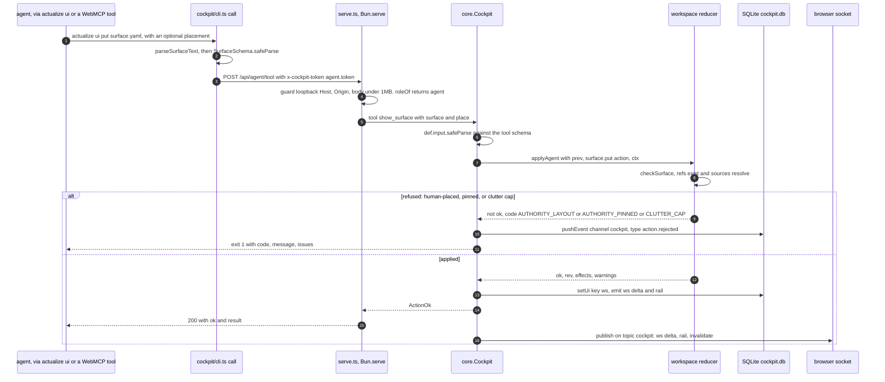
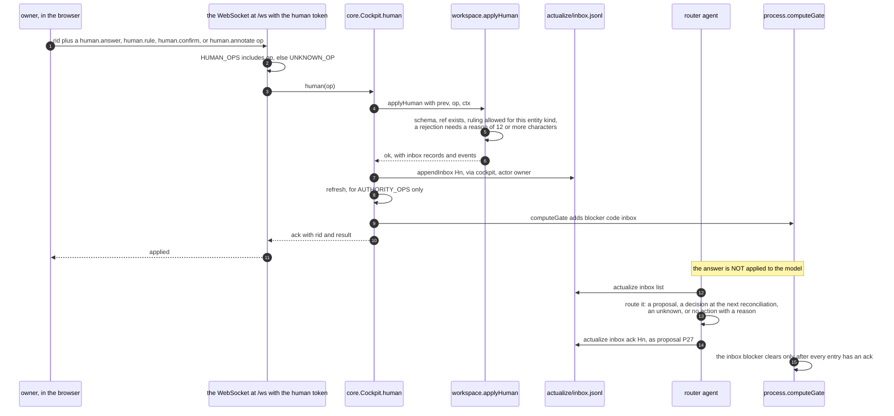
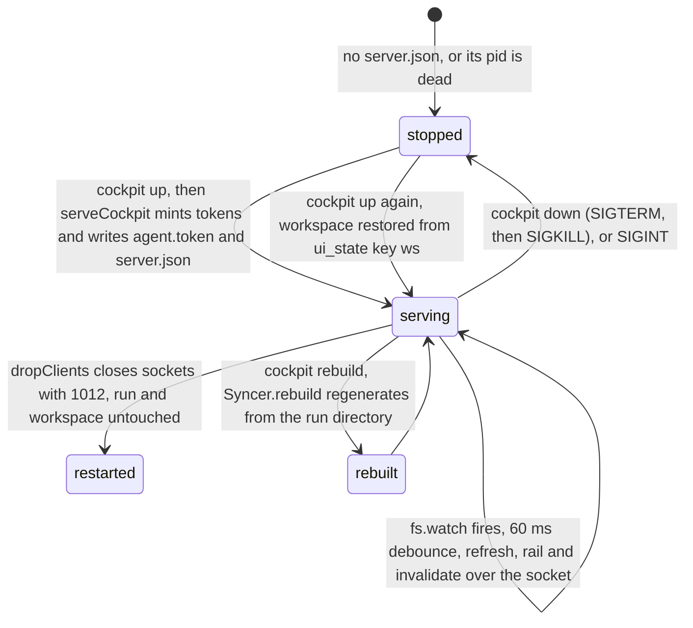

# A live cockpit session

## Summary

This page traces the cockpit as a running system: start, project, compose, render, owner input, route. The subsystem
guide (`docs/subsystems/cockpit.md`) covers what the cockpit is; this covers execution.

The invariant: **the run directory is authoritative, SQLite's projection is disposable (its `control_*` tables are the cockpit's own durable state, never process truth), and every owner gesture is an
inbox entry the router must route** (`cockpit/server/db.ts:1-3`, `hooks/src/lib/inbox.mjs:1-3`,
`cockpit/server/project.ts:1-3`). `project(cwd)` is a pure function of files on disk and consults no cockpit state,
so the rail and every process-backed view are by construction a function of process state (`project.ts:1-2,26`).
`Syncer.rebuild()` deletes and regenerates to prove the DB holds nothing the run cannot recreate (`sync.ts:120-126`).

## Sequence

**Agent compose path.**

What to notice: the CLI applies `SurfaceSchema` *before* the HTTP call, so a malformed surface file never reaches the
server (`cockpit/cli.ts:92-95`); the tool definition's own Zod schema then parses again (`core.ts:185-187`;
`protocol/tools.ts:23`). Authority is enforced by the reducer, not by the transport: the transport only decides
`agent` vs `human` (`serve.ts:30-33`). `action.rejected` is a local event row, not a broadcast (`core.ts:132-133`).
Omitted: `/api/data`, `/api/detail`, `/api/search`, `/api/file`, `/mcp`, and the `ui` subcommands that read rather
than compose.

**Owner input path.**

What to notice: `AUTHORITY_OPS` (`human.answer`, `human.rule`, `human.confirm`, `human.annotate`) are the four ops
that write an inbox record and are never accepted from an agent role (`protocol/actions.ts:63`, `workspace.ts:180`).
Non-authority human ops (layout, pin, size, close, open) change only preference and skip the refresh. The write to
`inbox.jsonl` is the *only* run-directory file the cockpit writes, and the agent cannot write it directly
(`store.mjs:126`; asserted in `tests/cockpit/hooks-bun.test.ts:100-107`). Omitted: the routing decisions themselves,
which are the router's judgement, and the `human.select` / `human.control` in-block gestures.

## Detailed path

1. **`just cockpit-up`** runs `actualize cockpit up` in the project directory (`justfile:19-21`). With no run it says
   so and starts empty (`cockpit/cli.ts:31`). It spawns `actualize cockpit serve --cwd <project>` detached, reads one
   line, and requires `URL <link>` from it (`cli.ts:32-42`; `server/main.ts:9`).
2. **Daemon start.** `serveCockpit` builds a `Cockpit` (opens `.cockpit/cockpit.db`, runs one `syncer.refresh()`),
   mints two random tokens, writes the agent token to `.cockpit/agent.token` mode 0600, prints
   `URL http://127.0.0.1:<port>/#t=<humanToken>`, opens the browser, and writes `.cockpit/server.json`
   (`serve.ts:22-28,105-119`; `main.ts:9-11`). The human link is printed only on a TTY or with `--print-url`
   (`cli.ts:44-45`).
3. **Projection.** `project(cwd)` reads the run: model, proposals, `inspectArtifacts`, `computeGate`, versions from
   `history/model-v*.md`, the evidence listing, the inbox, and the log (`project.ts:26-72`). `writeRows` wipes and
   refills `entities` plus the FTS `search` table in one transaction (`sync.ts:25-42`).
4. **Live updates without polling.** `fs.watch(runDir, {recursive:true})` arms a 60 ms debounce; each fire calls
   `cockpit.refresh()`; changes under `.cockpit` are ignored (`serve.ts:108-117`). `refresh()` emits `rail`, `hints`,
   `events`, and `invalidate` only when the run state or the event list changed (`core.ts:69-82`). Events come from
   two places, neither authoritative: the engine's `.log.jsonl` via `fromLog`, and diffs between two projections via
   `diffEvents` (`sync.ts:1-4,47-94`).
5. **Agent composes.** `actualize ui put` → `SurfaceSchema` locally → `POST /api/agent/tool` → `Cockpit.tool` →
   `applyAgent`. `applyAgent` is `(state, action, actor, ctx) → state'` with no I/O, no DOM, and no clock beyond
   `ctx.now` (`workspace.ts:1`). Twelve agent ops exist (`protocol/actions.ts:32-34`). An existing surface is replaced
   in place, keeping the owner's position, with a `PLACEMENT_IGNORED` warning (`workspace.ts:196-206`; asserted
   `tests/cockpit/live.test.ts:118-130`). Cap: 8 surfaces, evicting the least-recent unpinned one, never one waiting on
   an answer (`workspace.ts:12,207-213`; `live.test.ts:142-150`).
6. **Rail re-derives.** `railOf(proj)` computes counts (open proposals, unknowns, contradictions, stale, blockers,
   waiting) and `Cockpit.rail()` adds the cockpit's own open-ask count — explicitly the only thing the agent cannot
   edit (`project.ts:76-92`; `core.ts:84-88`).
7. **The browser renders** from the `ws` delta: topology whole, panels by revision (`core.ts:103-114`).
8. **The owner answers.** `human.answer` requires a non-empty value for `outcome: "answered"`; `human.rule` is limited
   per entity kind (`proposal: accept|reject|question`, `unknown: answer|question`, `decision: question`), and a
   rejection needs 12 or more characters because the router must log it (`workspace.ts:342-356`;
   `tests/cockpit/authority.test.ts:86-90`).
9. **Inbox, then routing.** `appendInbox` writes `H1`, `H2`, … with `via:"cockpit", actor:"owner"`
   (`inbox.mjs:29-35`). The router reads `actualize inbox list`, routes each through proposals or the next
   reconciliation, and only then runs `inbox ack <id> --as "<where it went>"`; an `as` under 6 characters is refused
   (`inbox.mjs:37-44`; asserted `authority.test.ts:75-85`). Until then `computeGate` emits blocker `inbox`
   (`process.mjs:77`).
10. **Hook visibility.** The cockpit writes `.cockpit/context.json` on every commit; the engine prints one `[cockpit]`
    line, suppressed when `process.kill(pid, 0)` says the server is gone (`core.ts:168-173`;
    `authority.test.ts:168-178`).

## State changes

What to notice: every arrow leaves the run directory alone. `down` prints that the model and inbox are untouched
(`cli.ts:59`); `rebuild` proves the projection is derived (`sync.ts:120-126`); the workspace itself lives in
`ui_state` and is restored on the next start (`core.ts:29`). Omitted: the schema-version reset path, which drops and
rebuilds the projection tables rather than migrating (`db.ts:17-21`).

| Where state lives | What it holds | Who writes it |
|---|---|---|
| `actualize/*.md`, `inbox.jsonl`, `.log.jsonl` | authoritative process state | the process CLI, the router, and the cockpit for the inbox only |
| `actualize/.cockpit/cockpit.db` | projection: `entities`, `search`, `events` (process), `meta` (disposable). Cockpit state: `ui_state` (`ws`, `terminal`, `agent.seen`), `interactions`, `events` (cockpit), `control_*` (durable) | the syncer, the reducer, and the control repository |
| `actualize/.cockpit/agent.token`, `server.json` | the agent's bearer token, daemon pid and port | the server |
| `.cockpit/context.json` | one advisory status line for the hook engine | `writeContext` (`core.ts:168-173`) |
**What never happens.** Verified by `tests/cockpit/authority.test.ts`:

- The cockpit never edits the model. No agent action, tool, or human gesture changes any run file except
  `inbox.jsonl`, and open proposals stay open after a ruling (`authority.test.ts:54-68`).
- It never changes a grade: `human.rule` is accepted only for `proposal`, `unknown`, and `decision` refs, never for a
  claim (`workspace.ts:352-355`; `authority.test.ts:90`).
- It never moves a gate. `rail()` is derived from `Proj` and the agent cannot compose it: ops matching
  `rail|system|process|model|gate` fail `AUTHORITY_SYSTEM`, and a `surface.put` whose id starts with `system` fails
  too (`workspace.ts:181,250`; `authority.test.ts:30-45`).
- It never answers its own question. An agent `human.*` op fails `AUTHORITY_HUMAN`; `ask_human` creates an ask, and
  the answer arrives as an inbox record (`workspace.ts:180`; `protocol/tools.ts:29-30`).

## Failure branches

| Situation | Result | Rule |
|---|---|---|
| `cockpit up` with no run directory | starts empty; rail reports `hasRun: false` | `cli.ts:31`; `live.test.ts:20-22` |
| Daemon never prints `URL` | exit 1 pointing at `.cockpit/server.log` | `cli.ts:40-41` |
| Request with a non-loopback `Host` | 403 `loopback only` | `serve.ts:36`; `authority.test.ts:161-162` |
| Request with a cross-origin `Origin` | 403 `cross-origin request` | `serve.ts:38` |
| Body over 1 MB | 413 `body too large` | `serve.ts:39`; `authority.test.ts:165-166` |
| Missing or wrong token | 401 `UNAUTHORIZED` | `serve.ts:60-61` |
| Non-human token on `/ws` | 401 `unauthorized` | `serve.ts:55` |
| Non-`human.*` op over the socket | ack with `UNKNOWN_OP` | `serve.ts:97` |
| Surface file that fails `SurfaceSchema` | `{code:"SCHEMA", issues:[{path,message,expected}]}`, exit 1 | `cli.ts:94`; `actions.ts:86-92` |
| Agent action naming a `human.*` op | `AUTHORITY_HUMAN` | `workspace.ts:180` |
| Agent action naming rail, model, or gate state | `AUTHORITY_SYSTEM` | `workspace.ts:181` |
| `surface.remove` on a pinned surface | `AUTHORITY_PINNED` | `workspace.ts:252`; `live.test.ts:134` |
| `view.place` on a human-placed surface | `AUTHORITY_LAYOUT`; content may still change | `workspace.ts:273`; `live.test.ts:127-128` |
| Ninth agent surface with all 8 pinned or awaiting answers | `CLUTTER_CAP` | `workspace.ts:208`; `live.test.ts:142-150` |
| Ref naming a non-existent entity | `BAD_REF` naming the failing path | `authority.test.ts:193-199` |
| `human.rule` reject with a reason under 12 characters | `SCHEMA` | `workspace.ts:355` |
| `inbox ack` without `--as`, or `--as` under 6 characters | exit 1 | `inbox.mjs:41`; `authority.test.ts:80` |
| `inbox ack` twice for the same id | `already handled` | `inbox.mjs:40` |
| Any `human.*` response left unacked | gate blocker `inbox`; rail shows `waiting` | `process.mjs:77`; `authority.test.ts:75-85` |
| Garbage action, tool, or op | structured error; workspace revision unchanged | `authority.test.ts:181-192` |

### Source trail

- Start: `justfile:19-21`; `cockpit/cli.ts:14-23,25-70`; `cockpit/server/main.ts:1-16`.
- Server and transport: `cockpit/server/serve.ts:15-28,30-41,51-103,105-123,132-147`.
- Core: `cockpit/server/core.ts:24-36,68-82,84-92,93-100,126-133,135-157,168-173,178-215`.
- Reducer: `cockpit/server/workspace.ts:1-13,24-36,175-215,250-252,273-285,332-375,429-447`.
- Projection and rail: `cockpit/server/project.ts:26-73,76-92`; `cockpit/server/sync.ts:25-42,47-94,96-127`;
  `cockpit/server/db.ts:10-49`.
- Vocabulary: `cockpit/protocol/actions.ts:10-34,36-63,66-93`; `cockpit/protocol/tools.ts:12-41`;
  `cockpit/protocol/spec.ts`; `cockpit/protocol/refs.ts`.
- Inbox: `hooks/src/lib/inbox.mjs:8-50`; gate blocker `hooks/src/process.mjs:77`.
- Agent-facing skill: `skills/cockpit/SKILL.md:13-30`.
- Evidence: `tests/cockpit/live.test.ts:20-22,23-48,118-130,131-150,163-174`;
  `tests/cockpit/authority.test.ts:29-45,53-90,100-118,156-178,181-199`.
- Layer-3 subsystem page (read, not duplicated): `docs/subsystems/cockpit.md`.
