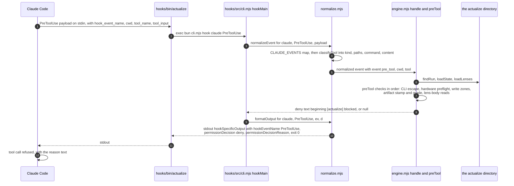
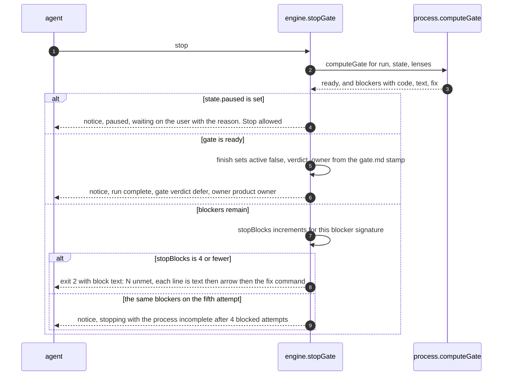

# Hook enforcement: how a write gets denied

## Summary

This page traces one gated tool call from a client's native event to a native refusal. The subsystem guide
(`docs/subsystems/hooks.md`) covers how the code is built; this covers what happens, in order, on one call.

One decision function, `handle(ev, env)` in `hooks/src/engine.mjs:16-33`, returns
`{ context?, deny?, block?, feedback?, notice? }` (`engine.mjs:2`). Everything else is translation: `normalizeEvent`
turns a native payload into a normalized event, `formatOutput` turns the decision back into native output and an exit
code (`hooks/src/normalize.mjs:61-108`). With no `actualize/state.json` above cwd the function returns `null` and the
process is silent (`engine.mjs:17-18`).

Two deliveries carry authority: a `deny` on `pre_tool` blocks the write; a `block` on `stop` prevents the agent from
finishing. `feedback` and `notice` do neither.

## Sequence

What to notice: the exit code stays 0 on a denial for Claude Code and Codex; the refusal is carried in stdout JSON
(`normalize.mjs:97-99`, asserted at `tests/cockpit/hooks-bun.test.ts:60-66`). The engine writes a `deny` row to
`.log.jsonl` before returning (`engine.mjs:175`). Omitted: the `post_tool` path (feedback, exit 2), the
`session_start` and `prompt` context injections, and the in-process hosts `hooks/clients/opencode/actualize.js` and
`hooks/clients/prime/actualize.ts`, which call `engine.handle` with no process boundary
(`docs/subsystems/hooks.md:49`).

## Detailed path

**Order of checks in `preTool` (`engine.mjs:108-176`).** Each step appends to a `denials` array; the array is joined
into one message.

1. **No tool, no decision** (`engine.mjs:109-110`).
2. **CLI escape.** If the command mentions `CLI_PATH` or `actualize`, `handle` returns `null`: the process CLI is
   trusted to write run state (`engine.mjs:111-112`).
3. **Hardware preflight (strict mode).** `hardwareAction` refuses irreversible changes unconditionally and refuses
   flashing without a recorded preflight in the running lens's `evidence/<lens>/actions.md`; the refusal is logged as
   `preflight_required` (`engine.mjs:117-120`, `:95-106`).
4. **Collect targets.** `write`/`edit`/`patch` paths become write targets, `read` paths become read targets, and bash
   commands are scanned by the `WRITE_OPS`/`READ_OPS` regexes and by redirect targets, so
   `echo hi > actualize/product-model.md` is caught the same as a `Write` (`engine.mjs:122-132`, `:183-203`).
5. **Zone switch, per write target** (`store.mjs:116-131`, `engine.mjs:134-156`):
   `state` and `history` are managed by the CLI; `model` is refused unless `state.phase === "reconcile"`; `proposals`
   is refused outside a lens run or a reconciliation; `artifact` and `evidence` are refused during a reconciliation and
   unless that lens is the running one; `run-other` is refused because nothing else exists under `actualize/`; and
   `project` files change only inside a lens run, with dotfiles exempt.
6. **Artifact content validation**, only if nothing was denied yet and the tool carries content (`engine.mjs:157-167`).
   `validateArtifact` runs against the current model with `currentVersion: state.modelVersion`, so it rejects a
   missing stamp, `reads` outside the lens's declared reads, a `built_from` that is not the current version, cites
   absent from the ledger, a public artifact citing below `OBSERVED`/`VERIFIED`, an inline `[C…]` missing from `cites`
   (and the reverse, for non-gate artifacts), and for the gate a `verdict:` outside `go|no-go|defer|go-with-exception`
   or a missing `owner:` (`md.mjs:184-210`). With no model yet: `artifacts are written after the first reconciliation`
   (`engine.mjs:162`).
7. **Lens-body reads (strict).** Reading `skills/<lens>/SKILL.md` is refused unless that lens is running
   (`engine.mjs:168-172`; `replay.test.mjs:37-38`).
8. **Decision.** No denials gives `null`. Otherwise log `{type:"deny", tool, reasons}` and return
   `{deny: "[actualize] blocked: …"}` (`engine.mjs:174-176`).

**Tamper detection (`engine.mjs:208-210`, `process.mjs:69`).** `state.modelHash` is written only at
`reconcile done` (`process.mjs:325`). Post-tool, if the phase is not `reconcile` and `modelHash(run)` differs from
`state.modelHash`, the engine returns feedback telling the agent to revert with `model restore` and record the change
as a proposal. The same comparison becomes gate blocker `model-tampered` whose fix is `model restore`, so a write that
escaped the write-time refusal still fails the gate and the stop check. `model restore` rewinds to the snapshot
`reconcile start` wrote to `.state/model.base.md` (`process.mjs:350-358`).

**The Stop gate (`engine.mjs:242-262`).**

What to notice: the block text embeds each blocker's own `fix` command, so the agent is handed the next command to run
(`engine.mjs:260-261`; `process.mjs:54-90` builds the list). The loop guard resets when the blocker signature changes
or when `lensStart` or `reconcile done` runs (`engine.mjs:250`, `process.mjs:242,330`). Omitted: the blocker codes
themselves (`select`, `reconcile-open`, `lens-open`, `unreconciled`, `model-missing`, `model-tampered`,
`model-invalid`, `proposals-open`, `lens-not-run`, `inbox`, `artifact-invalid`, `stale`, `no-gate`, `gate-stale`), and
the fact that `pause` is cleared by the next `prompt` event (`engine.mjs:26`).
**Per-client delivery.** Same engine, different transport. `formatOutput` is the only place the difference lives
(`normalize.mjs:84-108`).

| Client | Pre-tool denial | Stop refusal | Source |
|---|---|---|---|
| Claude Code | exit 0 plus `hookSpecificOutput` with `hookEventName`, `permissionDecision: deny`, `permissionDecisionReason` | exit 2 on stderr | `normalize.mjs:97-102`; `hooks-bun.test.ts:60-72` |
| Codex | identical payload shape, same JSON | same exit 2 | `codex.mjs:9-15`; `hooks-bun.test.ts:73-76` |
| Cline | exit 0 plus `{cancel:true, errorMessage}`; `{}` when there is nothing to say | cannot block task completion; `TaskComplete` only reports | `normalize.mjs:88-94`; `cline.mjs:1-3`; `hooks-bun.test.ts:77-84` |
| OpenCode | in-process plugin throws on `tool.execute.before` | no veto; the blocker surfaces as model context | `hooks/clients/opencode/actualize.js`; `hooks-bun.test.ts:85-90` |
| Pi / Prime | in-process extension returns `{block:true}` from `tool_call` | no veto | `hooks/clients/prime/actualize.ts`; `hooks-bun.test.ts:91-97` |

Consequence: on Cline, OpenCode, and Pi the stop gate reports but cannot prevent the agent from finishing; only the
PreToolUse gate and context injection carry enforcement (`cline.mjs:2-3`).

**Fail-open on a missing runtime.** `hooks/bin/actualize:9-13` writes one stderr line and exits 0 when `bun` is
absent, so a hook never bricks the client; every other subcommand exits 127 (`hooks-bun.test.ts:109-118`).

**Where the hooks are wired.** `bun hooks/install.mjs` merges command entries per event into each client's own config,
strips only its own (`OWNED_CMD`, `actualize-managed`), and backs up first (`hooks/adapters/common.mjs:9-11,52-82`;
`claude-code.mjs:7-14`; `codex.mjs:9-17`; `cline.mjs:12`; `opencode.mjs:11-13`; `prime.mjs:10-12`). Idempotency and the
absence of `node` in the generated command are asserted in `hooks-bun.test.ts:26-49`.

## State changes

The engine holds no run state; it reads it. The state it compares against lives in `actualize/state.json`
(`store.mjs:72-90`): `phase`, `active`, `activeLenses`, `modelVersion`, `modelHash`, `selection`, `unreconciled`,
`stopBlocks`, `lastBlockSig`, `paused`.

| Event | State read | State written |
|---|---|---|
| `session_start` / `compact` | run, state, gate | none |
| `prompt` | state | clears `state.paused` (`engine.mjs:26`) |
| `pre_tool` | run, state, lenses, files on disk | a `.log.jsonl` `deny` row only |
| `post_tool` | state, model hash, artifact text | a `.log.jsonl` `feedback` row only |
| `stop` | the gate | `stopBlocks`, `lastBlockSig`; `finish()` sets `active=false`, `verdict`, `owner` (`engine.mjs:250-258`; `process.mjs:337-348`) |

Protected zones the agent cannot write under any circumstance: `state.json`, `.state/`, `.cockpit/`, `.log.jsonl`,
and `inbox.jsonl` (zone `state`), plus `history/` (`store.mjs:126-127`; asserted for the inbox and cockpit files at
`hooks-bun.test.ts:100-107`).

## Failure branches

| Situation | What happens | Rule |
|---|---|---|
| No `state.json` above cwd | `null` for every event; a matching prompt gets the `begin --goal` nudge | `engine.mjs:17-18,35-38` |
| Write to `actualize/state.json` or `history/` | deny `managed by the process CLI` | `engine.mjs:136`; `replay.test.mjs:34-36` |
| `echo hi > actualize/product-model.md` in bash | denied via redirect targets, not only tool paths | `engine.mjs:130`; `replay.test.mjs:35` |
| Artifact written with `built_from` behind the current version | deny `built_from model@2 but the model is at version 4` | `md.mjs:193`; `replay.test.mjs:180` |
| Public artifact citing a `CONTRADICTED` claim | deny `graded CONTRADICTED` | `md.mjs:198` |
| `gate.md` with `verdict: maybe` | deny listing `go, no-go, defer, go-with-exception` | `md.mjs:206`; `replay.test.mjs:187` |
| Lens body read without `lens start <lens>` | deny naming `lens start brand` | `engine.mjs:170`; `replay.test.mjs:37-38` |
| Model edited outside a reconciliation | post-tool feedback, then gate blocker `model-tampered` | `engine.mjs:208-210`; `process.mjs:69` |
| Irreversible hardware command | unconditional deny; only `pause` then owner execution | `engine.mjs:96` |
| Flash command with no recorded preflight | deny naming `evidence/<lens>/actions.md` | `engine.mjs:104` |
| `stop` with blockers, fifth identical attempt | escalation notice, stop allowed | `engine.mjs:252-257`; `replay.test.mjs:203-204` |
| `stop` while `state.paused` | notice, stop allowed | `engine.mjs:243`; `replay.test.mjs:208` |
| `bun` missing on PATH | one stderr line, exit 0 for `hook`, 127 otherwise | `hooks/bin/actualize:9-15` |

### Source trail

- Engine: `hooks/src/engine.mjs:1-2,10-14,16-33,35-38,40-57,72-106,108-176,183-203,206-239,242-262`.
- Normalization and native output: `hooks/src/normalize.mjs:5-13,25-31,33-54,58-81,84-108`.
- Entry points: `hooks/bin/actualize:1-16`; `hooks/src/cli.mjs:1-4,50,83-112`.
- State and zones: `hooks/src/lib/store.mjs:25-57,72-90,98-101,116-131`.
- Model, artifact, and staleness rules: `hooks/src/lib/md.mjs:51-72,158-175,184-210,213-229`.
- Gate and reconciliation: `hooks/src/process.mjs:54-90,275-335,337-358`.
- Adapters: `hooks/adapters/common.mjs:8-11,52-82`; `claude-code.mjs:7-14`; `codex.mjs:8-17`; `cline.mjs:1-3,10-12`;
  `opencode.mjs:11-13`; `prime.mjs:10-12`.
- In-process clients: `hooks/clients/opencode/actualize.js`; `hooks/clients/prime/actualize.ts`.
- Evidence: `tests/hooks/replay.test.mjs:31-41,53-57,107-112,143-151,178-196,199-211`;
  `tests/cockpit/hooks-bun.test.ts:26-49,59-98,100-118`; `tests/hooks/helpers.mjs:40-46` (normalized event driver).
- Layer-3 subsystem page (read, not duplicated): `docs/subsystems/hooks.md:1-24,51-54,157-170`.
